# 📸 Instagram UI/UX Master Architectural Case Study

A comprehensive, production-grade architectural analysis of Instagram's design system, logo evolution, chromatic psychology, gesture ergonomics, and micro-interaction engineering — grounded in the core principles of the [UI/UX Master Design Bible](UI-UX-Master-Design-Bible.md).

> *"The best interface is the one you don't notice. In Instagram, the chrome steps aside completely so that user expression, visual storytelling, and human connection become the entire experience."*

---

## Table of Contents

1. [Core Design Philosophy: Content-First, Gesture-Native](#1-core-design-philosophy-content-first-gesture-native)
2. [Logo Evolution & Chromatic Psychology Spectrum](#2-logo-evolution--chromatic-psychology-spectrum)
3. [The 14-Year UI Evolution: 2010 to Present](#3-the-14-year-ui-evolution-2010-to-present)
4. [Instagram Sans: The Squircle-Driven Typography System](#4-instagram-sans-the-squircle-driven-typography-system)
5. [The Six Core Interface Surfaces](#5-the-six-core-interface-surfaces)
   - [Surface 1: Home Feed & Stories Architecture](#surface-1-home-feed--stories-architecture)
   - [Surface 2: Reels 9:16 Fullscreen Architecture](#surface-2-reels-916-fullscreen-architecture)
   - [Surface 3: Explore & Discovery Bento Grid](#surface-3-explore--discovery-bento-grid)
   - [Surface 4: Direct Messaging & Ephemeral Notes](#surface-4-direct-messaging--ephemeral-notes)
   - [Surface 5: Profile & 3x3 Identity Grid](#surface-5-profile--3x3-identity-grid)
   - [Surface 6: Creation & Camera HUD](#surface-6-creation--camera-hud)
6. [Stories Gestural Navigation & Segmented Timers](#6-stories-gestural-navigation--segmented-timers)
7. [Skeleton Loading UI & Perceived Performance](#7-skeleton-loading-ui--perceived-performance)
8. [Like Button Micro-Animation & Physics Pipeline](#8-like-button-micro-animation--physics-pipeline)
9. [Cognitive Psychology & The Retention Flywheel](#9-cognitive-psychology--the-retention-flywheel)
10. [Frontend Engineering & Mobile Client Architecture](#10-frontend-engineering--mobile-client-architecture)
11. [Ten Architectural Takeaways for Product Designers](#11-ten-architectural-takeaways-for-product-designers)
12. [Visual Asset Manifest](#12-visual-asset-manifest)

---

## 1. Core Design Philosophy: Content-First, Gesture-Native

Instagram’s design system is governed by a singular overarching mandate: **The Content is the UI**. Every border, background, and button exists solely to frame user imagery without introducing competing visual noise.

```text
┌────────────────────────────────────────────────────────────────────────┐
│                   THE INVISIBLE CHROME PRINCIPLE                       │
├────────────────────────────────────────────────────────────────────────┤
│ • Neutral Palette: 100% Monochrome tokens (#000000 / #FFFFFF)         │
│ • Zero Heavy Borders: Separators are 0.5px hairline dividers (#262626)  │
│ • Floating Micro-HUDs: Interaction controls float with subtle drop-shadows │
│ • Gesture Offloading: Replace explicit buttons with intuitive swipes   │
└────────────────────────────────────────────────────────────────────────┘
```

### The Content-First Interaction Pipeline

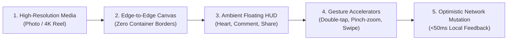

> [!IMPORTANT]
> **The Invisible Chrome Rule:** When designing media-rich applications, never use colored containers or decorative card borders around user content. Neutralize the interface canvas so that creator media provides 100% of the visual personality.

[⬆ Back to Table of Contents](#table-of-contents)

---

## 2. Logo Evolution & Chromatic Psychology Spectrum

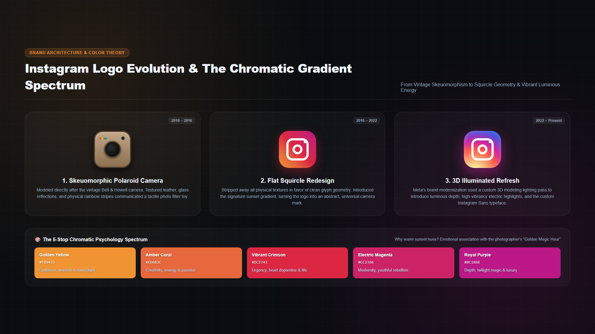

### The Strategic Shift in Brand Geometry & Emotion

The transformation of Instagram’s brand identity reflects the transition of digital products over the past decade:

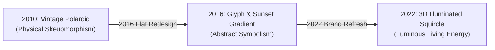

### Why the 5-Stop Sunset Gradient?

The gradient palette is not arbitrary decoration; it is an engineered emotional trigger rooted in photography culture and chromatic psychology:

| Color Token | Hex Code | Psychological Association | Role in Interface & Brand |
| :--- | :--- | :--- | :--- |
| **Golden Yellow** | `#F09433` | Optimism, sunrise warmth, dawn light | Direct association with the photographer's "Golden Hour" of natural sunlight. |
| **Amber Coral** | `#E6683C` | Vitality, creativity, social energy | Bridges yellow into red, preventing muddy color banding. |
| **Vibrant Crimson** | `#DC2743` | Passion, heart dopamine, urgency | Powers the heart micro-interaction and unread notification alerts. |
| **Electric Magenta** | `#CC2366` | Modernity, youthful rebellion, wonder | High visual salience on dark smartphone OLED displays. |
| **Royal Purple** | `#BC1888` | Twilight magic, luxury, creative depth | Anchors the gradient in dusk tones, evoking the conclusion of a creative shoot. |

### The Mathematics of the Squircle

Instagram’s logo and icon containers do not use standard rounded rectangles (`border-radius`). They use a mathematical **super-ellipse (Squircle)** defined by:

$$\left|\frac{x}{a}\right|^n + \left|\frac{y}{b}\right|^n = 1 \quad \text{where } n \approx 4.5$$

The continuous curvature variation of a squircle eliminates optical corner harshness, creating a softer visual weight that human vision perceives as organic and premium.

[⬆ Back to Table of Contents](#table-of-contents)

---

## 3. The 14-Year UI Evolution: 2010 to Present

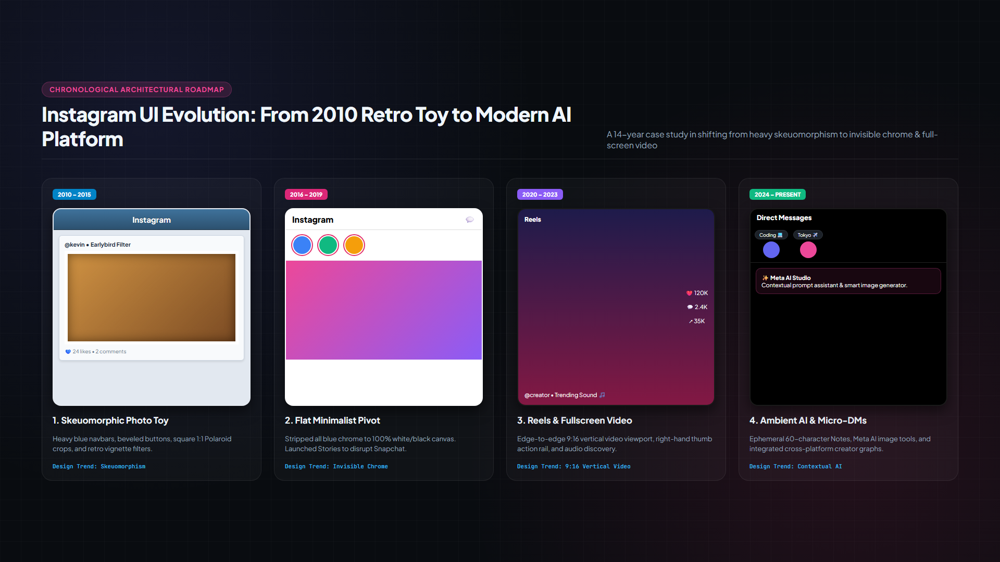

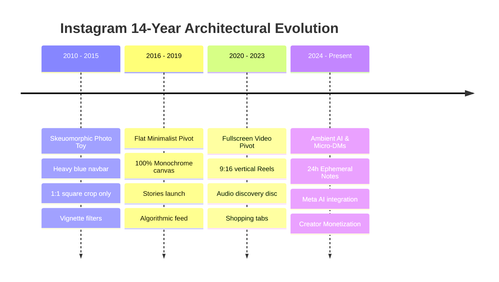

### Key Architectural Lessons from Instagram’s Evolution

1. **2010–2015 (The Skeuomorphic Era):** Heavy blue headers (`#3F729B`) and faux-leather camera borders established tactile familiarity during the early smartphone adoption wave.
2. **2016–2019 (The Minimalist Pivot):** When mobile photography matured, Instagram removed all colored UI elements, creating an invisible black-and-white stage for user media.
3. **2020–2023 (The Vertical Video Era):** Responding to short-form video consumption, Instagram made the entire viewport active video real estate with vertical snapping.
4. **2024–Present (The Conversational & AI Era):** Modern user behavior shifted from public feed broadcasting to private DM sharing, making lightweight 60-character Notes and ambient AI tools the primary retention drivers.

[⬆ Back to Table of Contents](#table-of-contents)

---

## 4. Instagram Sans: The Squircle-Driven Typography System

In 2022, Meta collaborated with type foundry **Colophon** to introduce **Instagram Sans**, a custom grotesque typeface rooted in the geometric identity of the Instagram app icon.

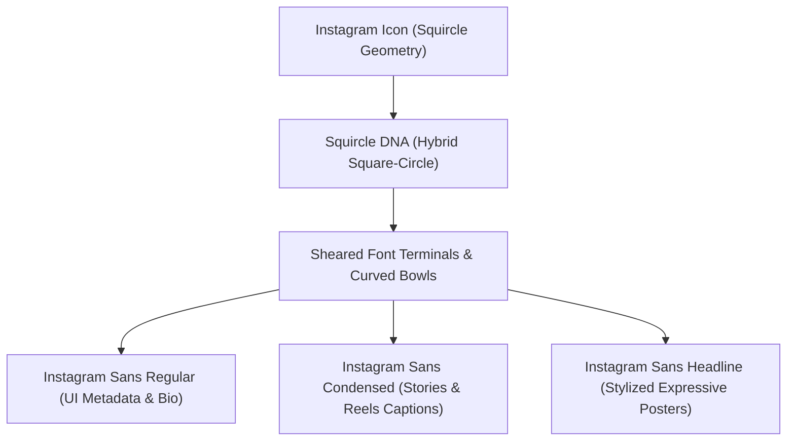

### Typography Variant Specifications

| Variant | Optical Geometry | Target UI Surface | Engineering Rationale |
| :--- | :--- | :--- | :--- |
| **Instagram Sans Regular** | Balanced grotesque proportions | Feed captions, profile usernames, comments | Delivers high legibility at 12px–14px body text across iOS & Android screens. |
| **Instagram Sans Condensed** | Narrow horizontal tracking | Stories stickers, Reels overlays | Maximizes character capacity in compact mobile viewports without wrapping. |
| **Instagram Sans Headline** | Expressive, calligraphic loops | Creative sticker tools, marketing titles | Serves as visual punctuation, giving creators an organic, hand-crafted feel. |

```css
/* Instagram Token System: Core Typography */
:root {
  --ig-font-primary: 'Instagram Sans', -apple-system, BlinkMacSystemFont, 'Segoe UI', Roboto, sans-serif;
  --ig-font-size-xs: 0.75rem;    /* 12px: Timestamps & Metadata */
  --ig-font-size-sm: 0.8125rem;  /* 13px: Captions & Comments */
  --ig-font-size-md: 0.875rem;   /* 14px: Usernames & Direct Messages */
  --ig-font-size-lg: 1.00rem;    /* 16px: Section Headers */
  --ig-font-size-xl: 1.375rem;   /* 22px: Modal & Screen Titles */
  --ig-font-weight-regular: 400;
  --ig-font-weight-semibold: 600;
  --ig-font-weight-bold: 700;
}
```

[⬆ Back to Table of Contents](#table-of-contents)

---

## 5. The Six Core Interface Surfaces

---

### Surface 1: Home Feed & Stories Architecture

#### The Dual-Engine Experience: Ephemeral Exploration + Curated Feed

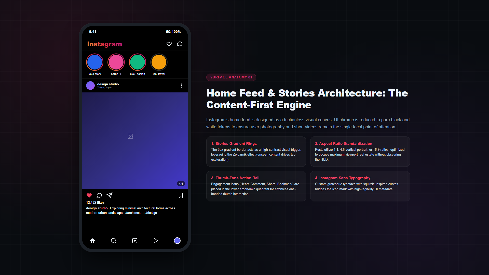

```text
┌────────────────────────────────────────────────────────────────────────┐
│ [Logo: Instagram]                                     [ ❤️ ]  [ 💬/DMs ]│
├────────────────────────────────────────────────────────────────────────┤
│ STORIES TRAY (Horizontal Ephemeral Carousels)                          │
│  ╭───╮      ╭───╮      ╭───╮      ╭───╮                                │
│  │ + │      │ ⭕ │      │ ⭕ │      │ ⚫ │                                │
│  ╰───╯      ╰───╯      ╰───╯      ╰───╯                                │
│ Your Story  sarah_k    alex_ui   leo_travel (Seen)                     │
├────────────────────────────────────────────────────────────────────────┤
│ MAIN FEED POST (Vertical Scroll)                                       │
│ [Avatar] design.studio • Tokyo, Japan                           [...]  │
│ ┌────────────────────────────────────────────────────────────────────┐ │
│ │                                                                    │ │
│ │                         EDGE-TO-EDGE MEDIA                         │ │
│ │                         (4:5 Portrait Ratio)                       │ │
│ │                                                                    │ │
│ └────────────────────────────────────────────────────────────────────┘ │
│  ❤️   💬   ↗                                                       🔖  │
│  12,482 likes                                                          │
│  design.studio Exploring minimal architectural forms...                │
└────────────────────────────────────────────────────────────────────────┘
```

#### 1. Stories Ring Psychology & Zeigarnik Effect

The top Stories tray is Instagram’s primary daily engagement driver. Unwatched stories feature a radiant multi-stop gradient border (`#f09433` $\rightarrow$ `#dc2743` $\rightarrow$ `#bc1888`). The visual tension of the bright, incomplete ring leverages the **Zeigarnik Effect** — human memory experiences subconscious cognitive tension when confronted with an unfinished task, compelling the user to tap and "clear" the ring.

#### 2. Ergonomic Aspect Ratios

Instagram shifted from its original strict 1:1 square format to support **4:5 vertical portrait media (1080x1350px)**. This aspect ratio occupies up to 78% of standard mobile viewport heights, maximizing immersion and minimizing distractions from neighboring feed items.

#### 3. Thumb-Zone Action Cluster

In accordance with **Fitts's Law** ($T = a + b \log_2(1 + D/W)$), engagement actions (Like, Comment, Share, Bookmark) are clustered in the lower thumb reach zone. The Bookmark button is deliberately isolated on the far right to prevent accidental taps while enabling 1-tap personal curation.

[⬆ Back to Table of Contents](#table-of-contents)

---

### Surface 2: Reels 9:16 Fullscreen Architecture

#### Vertical Video Immersion & Frictionless Swipe Mechanics

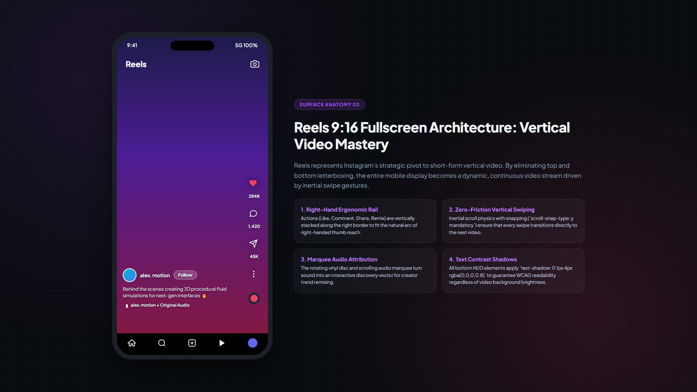

```text
┌────────────────────────────────────────────────────────────────────────┐
│  Reels                                                             📷  │
│                                                                        │
│                                                            ╭───────╮   │
│                                                            │   ❤️  │   │
│                                                            │ 284K  │   │
│                                                            ╰───────╯   │
│                                                            ╭───────╮   │
│                                                            │   💬  │   │
│                       FULLSCREEN 9:16                      │ 1.4K  │   │
│                      VERTICAL VIEWPORT                     ╰───────╯   │
│                                                            ╭───────╮   │
│                                                            │   ↗   │   │
│                                                            │  45K  │   │
│                                                            ╰───────╯   │
│                                                            ╭───────╮   │
│                                                            │  (...)│   │
│  [Avatar] alex.motion • [ Follow ]                         ╰───────╯   │
│  Behind the scenes creating 3D fluid simulations 🔥       ╭───────╮   │
│  🎵 alex.motion • Original Audio                          │ 💿 Disc│   │
└───────────────────────────────────────────────────────────┴───────┴────┘
```

#### 1. Right-Hand Action Rail

The right vertical rail aligns with the natural sweep of the right thumb. Each icon is encapsulated in a circular transparent hit target ($44\times44\text{pt}$ minimum) paired with high-contrast text drop shadows (`text-shadow: 0 1px 4px rgba(0,0,0,0.8)`) to maintain legibility across high-brightness video frames.

#### 2. Momentum-Based Vertical Swiping

Reels bypasses standard continuous page scrolling in favor of snap-to-viewport pagination:

```css
.reels-container {
  scroll-snap-type: y mandatory;
  overflow-y: scroll;
  height: 100vh;
}

.reel-item {
  scroll-snap-align: start;
  scroll-snap-stop: always;
  height: 100vh;
}
```

#### 3. Audio Attribution as a Discovery Flywheel

The bottom-right spinning vinyl disc acts as a gateway to community remixing. Tapping the audio track opens a curated catalog of all Reels utilizing the same sound snippet, transforming background music into a virality engine.

[⬆ Back to Table of Contents](#table-of-contents)

---

### Surface 3: Explore & Discovery Bento Grid

#### Asymmetric Visual Discovery & Algorithmic Serendipity

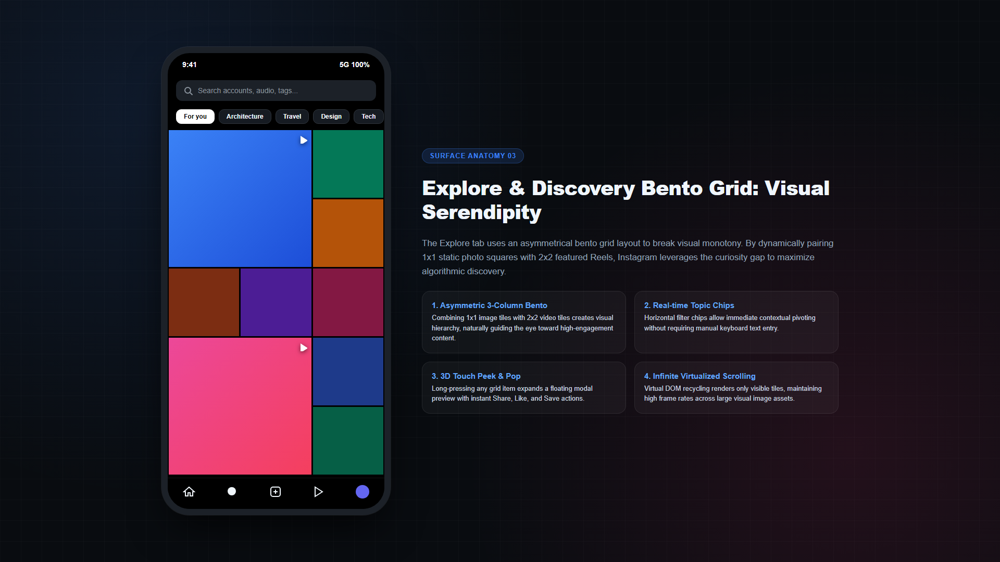

```text
┌────────────────────────────────────────────────────────────────────────┐
│  🔍 [ Search accounts, audio, tags...                                ] │
├────────────────────────────────────────────────────────────────────────┤
│  [ (★) For you ]  [ Architecture ]  [ Travel ]  [ Design ]  [ Tech ]   │
├────────────────────────────────────────────────────────────────────────┤
│  ┌───────────────────────────┬─────────────┐                           │
│  │                           │   PHOTO 1   │                           │
│  │                           ├─────────────┤                           │
│  │      FEATURED REEL        │   PHOTO 2   │                           │
│  │         (2x2 Tile)        ├─────────────┤                           │
│  │          [ ▶ Reel ]       │   PHOTO 3   │                           │
│  ├─────────────┬─────────────┼─────────────┤                           │
│  │   PHOTO 4   │   PHOTO 5   │   PHOTO 6   │                           │
│  └─────────────┴─────────────┴─────────────┘                           │
└────────────────────────────────────────────────────────────────────────┘
```

```mermaid
flowchart TD
    Tap["User Taps Search / Explore"] --> Bento["Render 3-Column Asymmetric Bento Grid"]
    Bento --> Interaction{"User Interaction"}
    Interaction -->|Quick Tap| Feed["Open Single-Item Fullscreen Viewer"]
    Interaction -->|Long Press (3D Touch)| Peek["Display Floating Modal Peek & Pop"]
    Interaction -->|Horizontal Scroll| Filter["Filter Stream by Real-Time Category Chip"]
```

- **The Bento Geometry:** Standard 3x3 grids can produce visual fatigue. Instagram interrupts this pattern by inserting 2x2 double-height video tiles at repeating mathematical intervals ($1:2$ rhythm), guiding the eye toward high-engagement content.
- **Peek & Pop Micro-Modals:** Long-pressing any grid item triggers a spring-animated preview card with instant shortcut actions (`Send in DM`, `Bookmark`, `Not Interested`) without unloading the search feed.

[⬆ Back to Table of Contents](#table-of-contents)

---

### Surface 4: Direct Messaging & Ephemeral Notes

#### Private Social Graphs & Low-Pressure Conversational Triggers

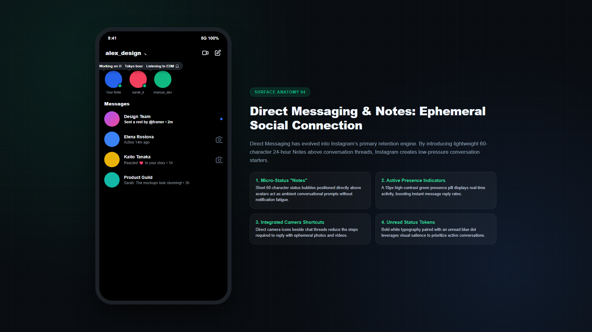

```text
┌────────────────────────────────────────────────────────────────────────┐
│  alex_design ▾                                                 📹  ✏️   │
├────────────────────────────────────────────────────────────────────────┤
│ 24-HOUR EPHEMERAL NOTES TRAY                                           │
│    ╭──────────────╮       ╭──────────────╮       ╭──────────────╮      │
│    │Working on UI 🎨│     │Tokyo bound ✈️│      │Listening 🎧  │      │
│    ╰──────┬───────╯       ╰──────┬───────╯       ╰──────┬───────╯      │
│         ╭─┴─╮                  ╭─┴─╮                  ╭─┴─╮            │
│         │ 🟢│                  │ 🟢│                  │   │            │
│         ╰───╯                  ╰───╯                  ╰───╯            │
│       Your Note               sarah_k               marcus_dev         │
├────────────────────────────────────────────────────────────────────────┤
│ MESSAGES INBOX                                                         │
│ [Avatar] Design Team                                                   │
│          Sent a reel by @framer • 2m                             🔵    │
│                                                                        │
│ [Avatar] Elena Rostova                                                 │
│          Active 14m ago                                          📷    │
└────────────────────────────────────────────────────────────────────────┘
```

- **Ephemeral Notes Architecture:** Notes introduce a lightweight social surface capped at 60 characters and 24-hour expiration. Positioned directly above the user's avatar with a speech bubble pointer (`::after` pseudo-element with 45° rotation), Notes remove the high friction of starting a direct message thread.
- **Active Presence Signifiers:** Real-time presence indicators (`#10b981` green dots with 2px solid black containment borders) indicate availability without displaying intrusive timestamps.

[⬆ Back to Table of Contents](#table-of-contents)

---

### Surface 5: Profile & 3x3 Identity Grid

#### Digital Persona Architecture & Spatial Curation

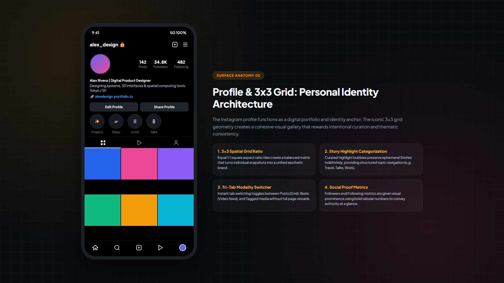

```text
┌────────────────────────────────────────────────────────────────────────┐
│  alex_design 🔒                                                ➕  ☰   │
├────────────────────────────────────────────────────────────────────────┤
│  ╭─────────╮     142            34.8K          482                     │
│  │ SQUIRCLE│    Posts         Followers     Following                  │
│  │ AVATAR  │                                                           │
│  ╰─────────╯                                                           │
│  Alex Rivera | Digital Product Designer                                │
│  Designing systems, 3D interfaces & spatial computing tools.           │
│  🔗 alexdesign.portfolio.io                                            │
│                                                                        │
│  [ Edit Profile ]                          [ Share Profile ]           │
├────────────────────────────────────────────────────────────────────────┤
│ HIGHLIGHT BUBBLES:  (✨ Projects)  (🇯🇵 Tokyo)  (📱 UI/UX)  (🎙️ Talks)  │
├────────────────────────────────────────────────────────────────────────┤
│  [ ⊞ Posts ]            [ ▷ Reels ]             [ 👤 Tagged ]          │
│ ┌──────────────┬──────────────┬──────────────┐                         │
│ │   Square 1   │   Square 2   │   Square 3   │                         │
│ ├──────────────┼──────────────┼──────────────┤                         │
│ │   Square 4   │   Square 5   │   Square 6   │                         │
│ └──────────────┴──────────────┴──────────────┘                         │
└────────────────────────────────────────────────────────────────────────┘
```

- **The 3x3 Square Matrix:** Profile tiles enforce a 1:1 aspect ratio. This spatial geometry establishes a cohesive gallery aesthetic, encouraging creators to curate consistent color palettes and thematic rhythm across multiple uploads.
- **Story Highlights Archiving:** Highlights elevate ephemeral 24-hour Stories into permanent, categorized profile chapters (e.g. Portfolio, Case Studies, Travel), serving as an interactive mini-website.

[⬆ Back to Table of Contents](#table-of-contents)

---

### Surface 6: Creation & Camera HUD

#### Frictionless Multi-Modal Capture & Expressive Tooling

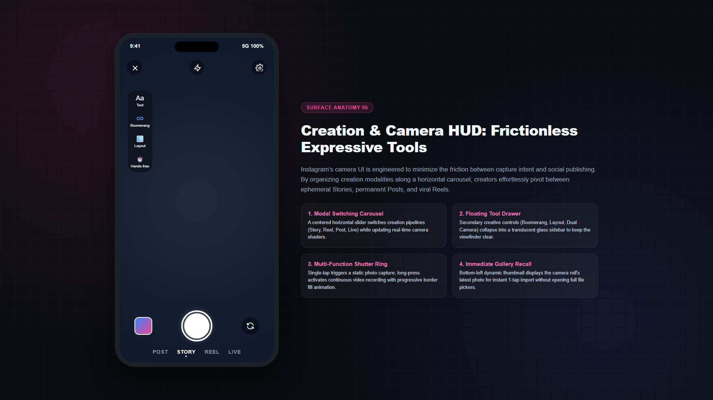

```text
┌────────────────────────────────────────────────────────────────────────┐
│  [ ✕ ]                         [ ⚡ Auto ]                      [ ⚙️ ]  │
│                                                                        │
│  ╭────────╮                                                           │
│  │ Aa Text│                                                           │
│  │ ♾️ Boom │               FULLSCREEN CAMERA VIEWFINDER                │
│  │ 🪟 Grid │                                                           │
│  │ ⏱️ Timer│                                                           │
│  ╰────────╯                                                           │
│                                                                        │
│   ╭───────╮                     ╭─────────╮                ╭───────╮   │
│   │Gallery│                     │ Shutter │                │ Flip  │   │
│   │Preview│                     │  Ring   │                │Camera │   │
│   ╰───────╯                     ╰─────────╯                ╰───────╯   │
│                                                                        │
│             POST          • STORY •          REEL          LIVE        │
└────────────────────────────────────────────────────────────────────────┘
```

- **Horizontal Modality Selector:** A single gesture changes capture pipelines (`POST` $\leftrightarrow$ `STORY` $\leftrightarrow$ `REEL` $\leftrightarrow$ `LIVE`) while seamlessly reconfiguring camera hardware parameters (frame rates, aspect ratios, AR face filters).
- **Multi-Function Shutter Ring:** Single tap triggers a static image capture; holding the shutter initiates continuous video recording with progressive border fill animation; dragging upward while holding controls optical zoom.

[⬆ Back to Table of Contents](#table-of-contents)

---

## 6. Stories Gestural Navigation & Segmented Timers

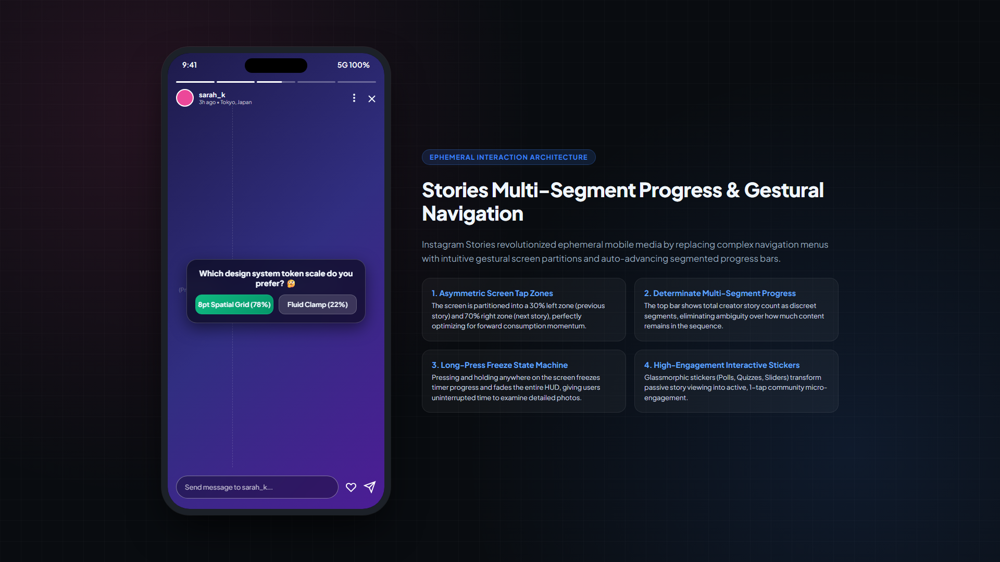

Instagram Stories replaced complex navigation menus with intuitive gestural screen partitions and auto-advancing segmented progress bars:

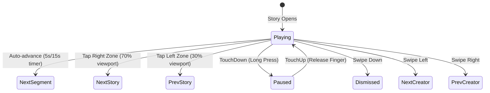

### Gestural Architecture Specs

- **30% / 70% Asymmetrical Tap Partition:** Because users consume content in a forward direction over 90% of the time, Instagram allocated 70% of horizontal screen space to the "Next Story" hit zone, preventing accidental backward jumps.
- **Hold-to-Pause State Machine:** When a user presses and holds anywhere on the screen, the progress timer freezes and the entire HUD (author name, icons, stickers) smoothly transitions to `opacity: 0`, allowing uninterrupted viewing.

[⬆ Back to Table of Contents](#table-of-contents)

---

## 7. Skeleton Loading UI & Perceived Performance

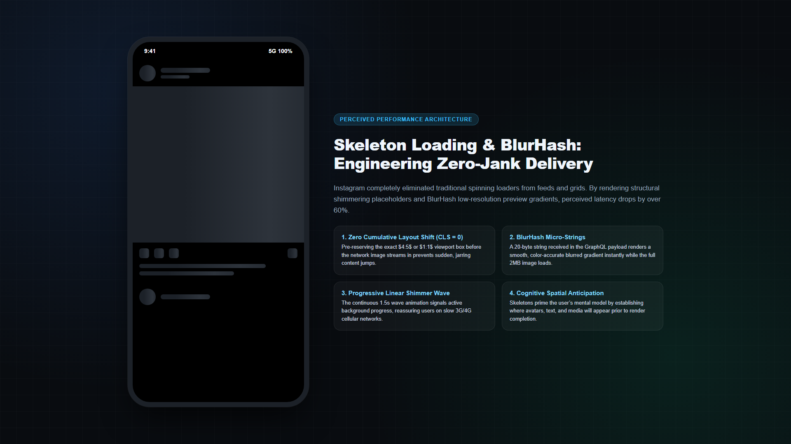

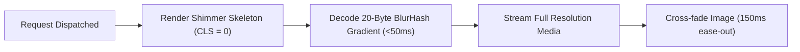

### Why Instagram Avoids Spinners

Spinning loaders provide zero structural context and heighten time awareness. Instagram employs a two-tier placeholder architecture:

1. **Structural Skeletons:** Animated shimmering grey bars (`#1c2128` $\rightarrow$ `#2d333b` $\rightarrow$ `#1c2128`) match the exact geometric layout of avatars, text, and action buttons.
2. **BlurHash Placeholder Decoding:** A compact 20-byte string in the initial GraphQL response renders a smooth, color-accurate blurred preview immediately, eliminating white flashes and guaranteeing **Cumulative Layout Shift (CLS) = 0**.

```css
/* Instagram Standard Shimmer Keyframe */
@keyframes ig-shimmer {
  0% { background-position: -200% 0; }
  100% { background-position: 200% 0; }
}

.shimmer-placeholder {
  background: linear-gradient(90deg, #1c2128 25%, #2d333b 50%, #1c2128 75%);
  background-size: 200% 100%;
  animation: ig-shimmer 1.5s infinite;
}
```

[⬆ Back to Table of Contents](#table-of-contents)

---

## 8. Like Button Micro-Animation & Physics Pipeline

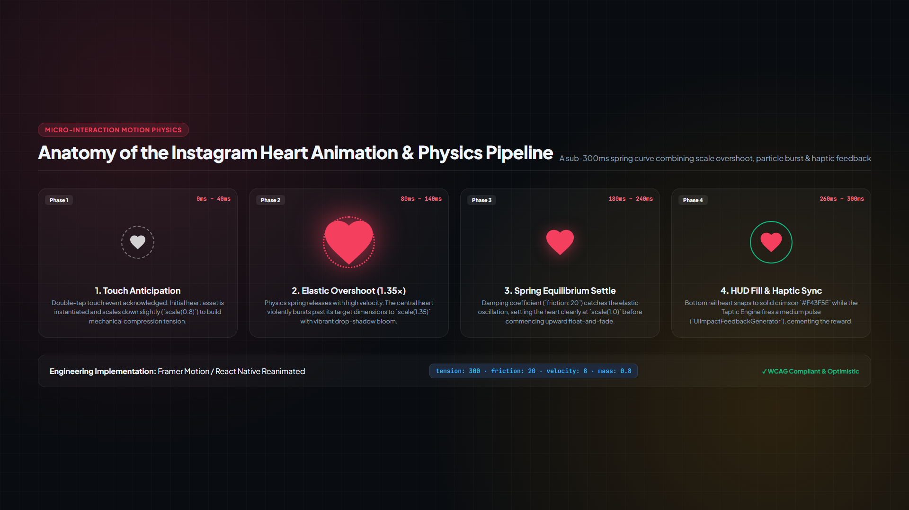

```mermaid
sequenceDiagram
    autonumber
    actor User
    participant Canvas as Photo Viewport (400x400pt)
    participant Particle as Center Heart Particle
    participant HUD as Bottom Heart Icon
    participant Haptic as Taptic Engine
    participant Server as Optimistic GraphQL Mutation

    User->>Canvas: Double-Tap Gesture (<300ms interval)
    Parall [Instant Local Feedback]
        Canvas->>Particle: Scale from 0 to 1.35x (Elastic Overshoot)
        Canvas->>HUD: Transition to #f43f5e Filled State
        Canvas->>Haptic: Trigger UIImpactFeedbackGenerator(.medium)
        Canvas->>Server: Dispatch optimistic like mutation
    end
    Particle->>Particle: Settle to 1.0x & Float Upward + Fade (800ms)
    Server-->>Canvas: Confirm 200 OK (Silent acknowledgment)
```

### Physics & Psychological Breakdown

- **Target Expansion via Fitts's Law:** Rather than forcing users to aim for a small $24\times24\text{pt}$ heart button in the bottom corner, the entire viewport ($400\times400\text{pt}$) becomes the touch target, reducing interaction friction to near zero.
- **Spring Dampening Curve:** The heart burst does not use a rigid linear animation. It utilizes a natural physical spring:

```javascript
// Spring Physics Parameters (Framer Motion / React Native Reanimated)
const heartSpring = {
  type: "spring",
  stiffness: 300,
  damping: 20,
  mass: 0.8
};
```

- **Multisensory Reward:** Visual burst + haptic tap + bottom heart fill form a cohesive sensory reward that triggers micro-dopamine reinforcement.
- **Forgiving Idempotency:** Double-tapping an already liked photo does **not** unlike it. It simply replays the spring delight animation, preventing accidental unlikes.

[⬆ Back to Table of Contents](#table-of-contents)

---

## 9. Cognitive Psychology & The Retention Flywheel

Instagram's product architecture aligns with proven cognitive psychology models:

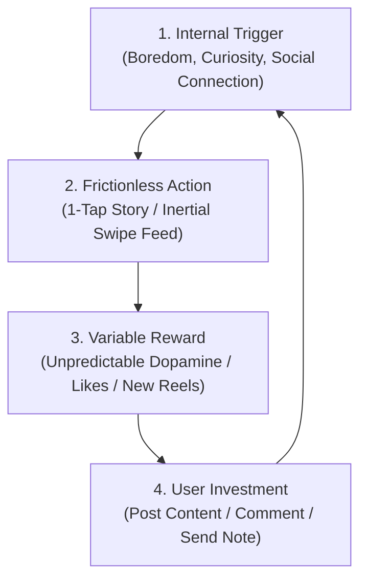

### Cognitive Laws Applied in Instagram

- **Variable Ratio Schedule (Skinner Box):** Pull-to-refresh feeds content in variable, unpredictable batches. Some refreshes reveal viral Reels; others reveal friend updates. This unpredictability keeps engagement high.
- **Hick-Hyman Law ($RT = a + b \log_2(n)$):** Stories limit choices to two simple taps: tap right to advance, tap left to go back. Decision latency is minimized.
- **The Peak-End Rule:** Finishing a creative Story with music and stickers ends with an animated publish confirmation, leaving the user with a feeling of creative accomplishment.

[⬆ Back to Table of Contents](#table-of-contents)

---

## 10. Frontend Engineering & Mobile Client Architecture

Instagram operates at a scale of over 2 billion active users. The user interface is backed by robust client-side engineering practices:

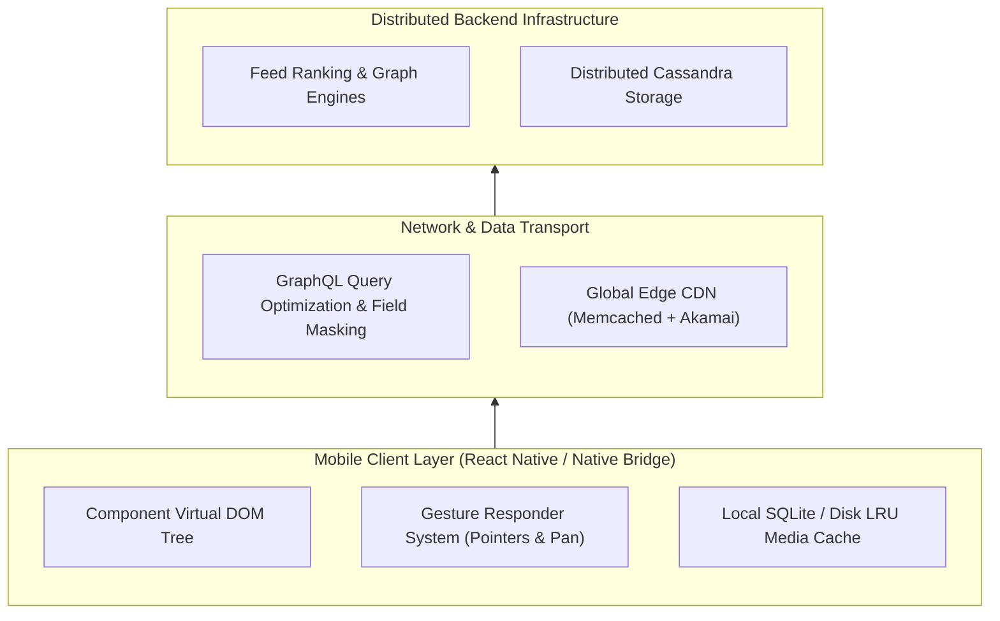

### Key Engineering Practices

1. **BlurHash Placeholder Decoding:** Before high-resolution photos download over cellular networks, Instagram decodes compact 20-character hash strings into smooth gradient blurs, ensuring zero layout shift (Cumulative Layout Shift = 0).
2. **Optimistic UI Mutations:** When a user likes, comments, or sends a DM, the client updates the UI immediately. The GraphQL mutation processes in the background, rolling back only in rare network dropouts.
3. **Aggressive Prefetching:** As the user scrolls through the feed, the video player engine proactively buffers the next 3 Reels in memory, enabling instant playback on the next swipe.

[⬆ Back to Table of Contents](#table-of-contents)

---

## 11. Ten Architectural Takeaways for Product Designers

```text
[ ] 1. INVISIBLE CHROME    → Remove heavy borders and dark card backgrounds around media.
[ ] 2. GESTURE OFFLOADING   → Enable double-taps, pinches, and swipes for primary workflows.
[ ] 3. SPATIAL CONSISTENCY  → Standardize on consistent ratios (1:1, 4:5, 9:16) across feeds.
[ ] 4. SQUIRCLE GEOMETRY    → Use squircle radii on containers to produce softer, modern corners.
[ ] 5. LOW-FRICTION STATUS  → Implement lightweight ephemeral triggers (Notes) to spur conversations.
[ ] 6. ZERO LAYOUT SHIFT    → Use BlurHash or skeleton placeholders while media loads.
[ ] 7. ASYMMETRIC BENTO     → Mix 1x1 static tiles with 2x2 dynamic video tiles to break monotony.
[ ] 8. THUMB-ZONE ALIGNMENT → Position primary conversion and engagement actions in the lower arc.
[ ] 9. FORGIVING GESTURES   → Ensure repeat positive actions (double-tap) do not trigger unlikes.
[ ] 10. MULTI-SENSORY TOUCH → Pair critical visual micro-interactions with subtle haptic pulses.
```

[⬆ Back to Table of Contents](#table-of-contents)

---

## 12. Visual Asset Manifest

All visual assets included in this case study are stored in the local `images/` directory.

| Asset Reference | Local File Path | Description |
| :--- | :--- | :--- |
| **Logo & Color Theory** | `images/instagram-logo-evolution.png` | 2010 Polaroid skeuomorphism vs 2016 flat gradient vs 2022 3D illuminated refresh & 5-stop chromatic spectrum. |
| **14-Year UI Evolution** | `images/instagram-ui-evolution.png` | 4-epoch chronological evolution (2010 Skeuomorphic, 2016 Minimalist, 2020 Reels, Present AI Platform). |
| **Skeleton Loading UI** | `images/instagram-skeleton-loading.png` | Shimmer skeleton placeholders, BlurHash gradient decoding, and zero CLS layout mechanics. |
| **Like Button Physics** | `images/instagram-like-animation-physics.png` | 4-phase spring micro-animation breakdown (Touchdown, Elastic Overshoot 1.35x, Spring Settle, HUD Haptic Sync). |
| **Stories Gestural UI** | `images/instagram-stories-gestures.png` | Segmented progress bars, 30%/70% tap zone partitions, hold-to-pause state machine, and interactive poll stickers. |
| **Home Feed & Stories** | `images/instagram-home-feed.png` | Stories tray gradient rings, 4:5 feed post framing, and thumb-zone actions. |
| **Reels 9:16 Fullscreen** | `images/instagram-reels.png` | Vertical edge-to-edge video canvas with right action rail and audio marquee. |
| **Explore Bento Grid** | `images/instagram-explore.png` | Asymmetric 3-column discovery grid with 2x2 featured video tiles and topic chips. |
| **Direct Messaging & Notes** | `images/instagram-dms.png` | 24-hour ephemeral 60-character Notes bubbles, active presence indicators, and message threads. |
| **Profile & 3x3 Grid** | `images/instagram-profile.png` | Profile squircle avatar, follower statistics, highlight chapters, and 3x3 post grid. |
| **Creation & Camera HUD** | `images/instagram-creation.png` | Multi-modal capture carousel (Story/Reel/Post), glass creative tools, and shutter ring. |
| **Double-Tap Interaction** | `images/instagram-microinteractions.png` | Heart burst particle physics, canvas touch expansion, and haptic feedback loop. |

---

### Concluding Insight

```text
Instagram’s longevity is not an accident of algorithms.
It is the direct result of a design system engineered to honor human psychology:
minimizing cognitive friction, celebrating creator identity,
and transforming every screen into an intuitive, touch-native canvas.
```

[⬆ Back to Table of Contents](#table-of-contents)
