# 💎 The UI/UX Master Design Bible

The definitive architectural framework — from cognitive science and design tokens to production engineering & real-world before/after case studies.

> *"A beautiful UI with poor UX is decoration. A functional UX with poor UI feels cheap. Neither one retains users on its own — only the harmonious combination builds lasting product habit."*

---

## Table of Contents

1. [The Foundational Split: UI vs UX](#1-the-foundational-split-ui-vs-ux)
2. [The Complete Design System Architecture](#2-the-complete-design-system-architecture)
3. [The Nine Layers of a Modern Interface](#3-the-nine-layers-of-a-modern-interface)
4. [Core Design Principles: Big Tech Titans](#4-core-design-principles-big-tech-titans)
5. [Mathematical Proportion Systems](#5-mathematical-proportion-systems)
6. [Visual Styles & When to Use Each](#6-visual-styles--when-to-use-each)
7. [Loading, States & the "Unhappy Path"](#7-loading-states--the-unhappy-path)
8. [The Modern Frontend & Design Engineering Stack](#8-the-modern-frontend--design-engineering-stack)
9. [Motion & Animation Technology Map](#9-motion--animation-technology-map)
10. [Cognitive Psychology, Business Logic & Retention](#10-cognitive-psychology-business-logic--retention)
11. [The Real-World Production Design Process](#11-the-real-world-production-design-process)
12. [Research & Benchmarking Ecosystem](#12-research--benchmarking-ecosystem)
13. [The 15 Real-World Before/After Visual Demos](#13-the-15-real-world-beforeafter-visual-demos)
    - [Demo 1: The Vanishing Save Button (Feedback & Confirmation)](#demo-1-the-vanishing-save-button)
    - [Demo 2: Loading Spinner vs Skeleton Screen (Perceived Performance)](#demo-2-loading-spinner-vs-skeleton-screen)
    - [Demo 3: The 12-Error Form Dump (Real-Time Inline Validation)](#demo-3-the-12-error-form-dump)
    - [Demo 4: Navbar Overload (Navigation Hierarchy & Progressive Disclosure)](#demo-4-navbar-overload)
    - [Demo 5: Card Overload Dashboard (Progressive Metrics & Chunking)](#demo-5-card-overload-dashboard)
    - [Demo 6: Search Box vs Command Palette (Keyboard-First Power Workflows)](#demo-6-search-box-vs-command-palette)
    - [Demo 7: Destructive Delete Without Undo (Forgiving Design & Agency)](#demo-7-destructive-delete-without-undo)
    - [Demo 8: Generic Placeholder-Only Inputs (Persistent Field Labels)](#demo-8-generic-placeholder-only-inputs)
    - [Demo 9: Flat vs Progressive Onboarding (Cognitive Load Reduction)](#demo-9-flat-vs-progressive-onboarding)
    - [Demo 10: Blind Waiting vs Staged AI Loading (AI Transparency & Legibility)](#demo-10-blind-waiting-vs-staged-ai-loading)
    - [Demo 11: Cluttered Chrome vs Content-First Feed (Immersion & Framing)](#demo-11-cluttered-chrome-vs-content-first-feed)
    - [Demo 12: Filter Overload vs Progressive Discovery (Sequential Decision Staging)](#demo-12-filter-overload-vs-progressive-discovery)
    - [Demo 13: Generic Empty State vs Guided Empty State (Actionable Onboarding)](#demo-13-generic-empty-state-vs-guided-empty-state)
    - [Demo 14: Frozen Blank Screen vs Determinate Progress (Wait Transparency)](#demo-14-frozen-blank-screen-vs-determinate-progress)
    - [Demo 15: Disconnected Chatbot vs Integrated Inline AI (Contextual Intelligence)](#demo-15-disconnected-chatbot-vs-integrated-inline-ai)
14. [How Big Tech Applies These Frameworks](#14-how-big-tech-applies-these-frameworks)
15. [Master Pre-Flight Cheat Sheet & Scorecard](#15-master-pre-flight-cheat-sheet--scorecard)
16. [Visual Asset & Prompt Reference Archive](#16-visual-asset--prompt-reference-archive)

---

## 1. The Foundational Split: UI vs UX

Understanding digital product design begins by disambiguating the visible surface (**User Interface**) from the underlying psychological journey (**User Experience**).

```text
┌──────────────────────────────────────────────┬──────────────────────────────────────────────┐
│             UI (User Interface)              │             UX (User Experience)             │
├──────────────────────────────────────────────┼──────────────────────────────────────────────┤
│ What the user SEES & TOUCHES                 │ What the user FEELS & ACCOMPLISHES           │
│ • Typography, optical weights, line heights  │ • Can the user achieve their goal easily?    │
│ • Color tokens, contrast ratios, elevations  │ • Is system feedback instant (<100ms)?       │
│ • Micro-interactions, spring curves, easing  │ • Are errors forgiving and self-recovering?  │
│ • Component styling, radii, borders, glass   │ • Does cognitive load match user intent?     │
└──────────────────────────────────────────────┴──────────────────────────────────────────────┘
```

### The UI/UX Retention Engine

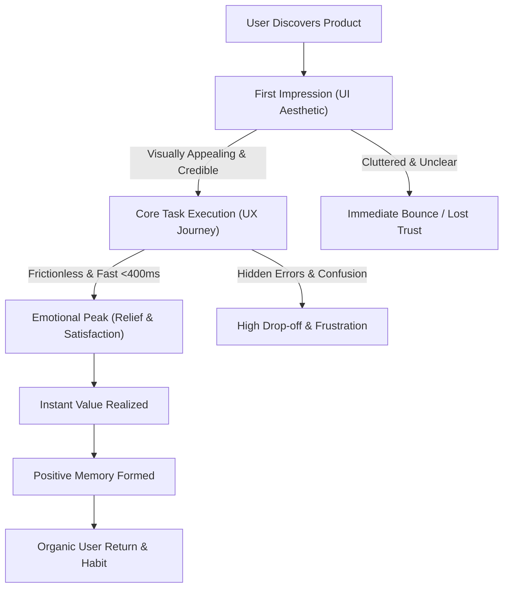
```mermaid
graph TD
    A["User Discovers Product"] --> B["First Impression (UI Aesthetic)"]
    B -->|Visually Appealing & Credible| C["Core Task Execution (UX Journey)"]
    B -->|Cluttered & Unclear| Z1["Immediate Bounce / Lost Trust"]
    C -->|Frictionless & Fast <400ms| D["Emotional Peak (Relief & Satisfaction)"]
    C -->|Hidden Errors & Confusion| Z2["High Drop-off & Frustration"]
    D --> E["Instant Value Realized"]
    E --> F["Positive Memory Formed"]
    F --> G["Organic User Return & Habit"]
```

> [!IMPORTANT]
> **The Doherty Threshold Rule:** Productivity skyrockets and user frustration plummets when computer and user interact at a pace where neither has to wait more than **400ms**. When feedback exceeds 400ms, the user perceives the system as sluggish, prompting duplicate clicks and abandonment.

[⬆ Back to Table of Contents](#table-of-contents)

---

## 2. The Complete Design System Architecture

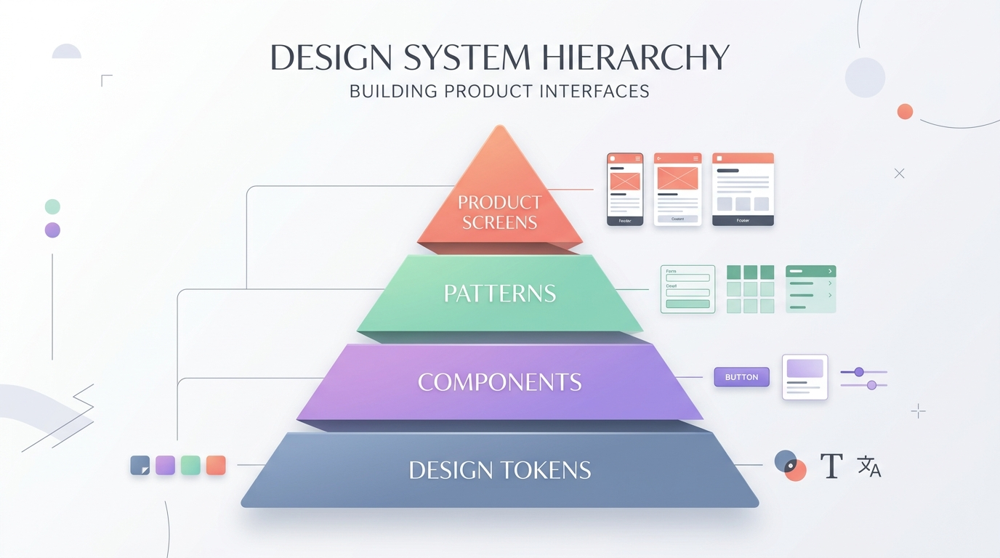

A production-grade design system establishes a single, shared vocabulary bridging Figma designers and frontend engineers. It enforces visual consistency and eliminates design drift across web, iOS, and Android applications.

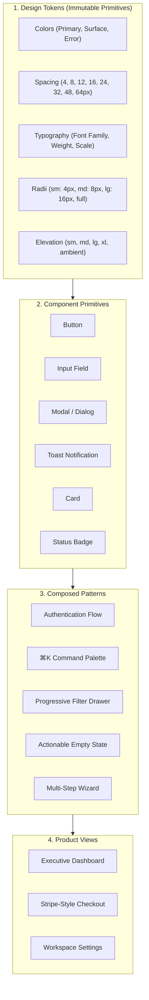
```mermaid
flowchart TD
    subgraph Tier1["1. Design Tokens (Immutable Primitives)"]
        T_Color["Colors (Primary, Surface, Error)"]
        T_Space["Spacing (4, 8, 12, 16, 24, 32, 48, 64px)"]
        T_Typo["Typography (Font Family, Weight, Scale)"]
        T_Radius["Radii (sm: 4px, md: 8px, lg: 16px, full)"]
        T_Shadow["Elevation (sm, md, lg, xl, ambient)"]
    end

    subgraph Tier2["2. Component Primitives"]
        C_Btn["Button"]
        C_Input["Input Field"]
        C_Modal["Modal / Dialog"]
        C_Toast["Toast Notification"]
        C_Card["Card"]
        C_Badge["Status Badge"]
    end

    subgraph Tier3["3. Composed Patterns"]
        P_Auth["Authentication Flow"]
        P_Search["⌘K Command Palette"]
        P_Filter["Progressive Filter Drawer"]
        P_Empty["Actionable Empty State"]
        P_Onboard["Multi-Step Wizard"]
    end

    subgraph Tier4["4. Product Views"]
        S_Dash["Executive Dashboard"]
        S_Check["Stripe-Style Checkout"]
        S_Profile["Workspace Settings"]
    end

    Tier1 --> Tier2
    Tier2 --> Tier3
    Tier3 --> Tier4
```

### Design Token Specification Matrix

| Token Category | Token Variable | Concrete Value | Implementation Purpose | Failure Mode If Omitted |
| :--- | :--- | :--- | :--- | :--- |
| **Color: Primary** | `--color-primary-600` | `#2563eb` (HSL: 221, 83%, 53%) | Key CTA buttons, active focus rings | Random shades like `#1a73e8` and `#3b82f6` |
| **Color: Surface** | `--color-surface-base` | `#ffffff` / `#0b0f17` (Dark) | Card & container canvas | Inconsistent backgrounds, jarring contrast |
| **Spacing Scale** | `--space-4` (16px base) | `1.00rem` (8pt Grid) | Default component padding | Arbitrary 13px or 17px awkward margins |
| **Border Radius** | `--radius-md` | `8px` (0.5rem) | Cards, inputs, modal containers | Sharp buttons next to rounded cards |
| **Elevation** | `--shadow-lg` | `0 20px 25px -5px rgba(0,0,0,0.1)` | Floating drawers, dropdown menus | Muddy, harsh black drop shadows |

> [!TIP]
> **Anti-Drift Governance:** Never declare ad-hoc color hex codes or pixel paddings inside component files. If a design requires a new shade, register it in the design token manifest first.

[⬆ Back to Table of Contents](#table-of-contents)

---

## 3. The Nine Layers of a Modern Interface

Every world-class product experience is built upon nine interdependent layers. A failure in any single layer degrades perceived product quality.

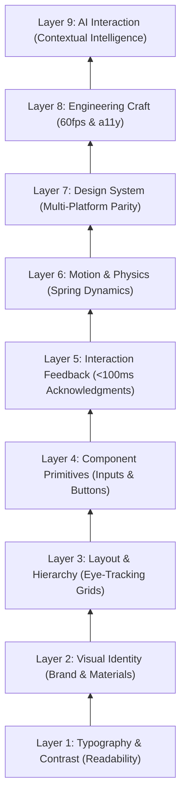
```mermaid
graph BT
    L1["Layer 1: Typography & Contrast (Readability)"] --> L2["Layer 2: Visual Identity (Brand & Materials)"]
    L2 --> L3["Layer 3: Layout & Hierarchy (Eye-Tracking Grids)"]
    L3 --> L4["Layer 4: Component Primitives (Inputs & Buttons)"]
    L4 --> L5["Layer 5: Interaction Feedback (<100ms Acknowledgments)"]
    L5 --> L6["Layer 6: Motion & Physics (Spring Dynamics)"]
    L6 --> L7["Layer 7: Design System (Multi-Platform Parity)"]
    L7 --> L8["Layer 8: Engineering Craft (60fps & a11y)"]
    L8 --> L9["Layer 9: AI Interaction (Contextual Intelligence)"]
```

```text
┌────────────────────────────────────────────────────────────────────────┐
│ 9. AI Interaction       → Contextual root-cause insights & 1-tap actions│
│ 8. Engineering Craft    → 60fps rendering, zero layout shift (CLS), a11y │
│ 7. Design System        → Tokens, reusable primitives, cross-platform  │
│ 6. Motion & Physics     → Meaningful state transitions, spring dampening│
│ 5. Interaction Feedback → Immediate button states, toasts, optimistic   │
│ 4. Component Primitives → Buttons, inputs, modals, popovers, dropdowns │
│ 3. Layout & Hierarchy   → Visual weight, Z-pattern scanning, whitespace│
│ 2. Visual Identity      → Color personality, brand tone, elevation     │
│ 1. Typography & Contrast→ Font readability, optical sizing, WCAG AAA   │
└────────────────────────────────────────────────────────────────────────┘
```

[⬆ Back to Table of Contents](#table-of-contents)

---

## 4. Core Design Principles: Big Tech Titans

World-class product organizations tune their design philosophies to serve specific human behaviors:

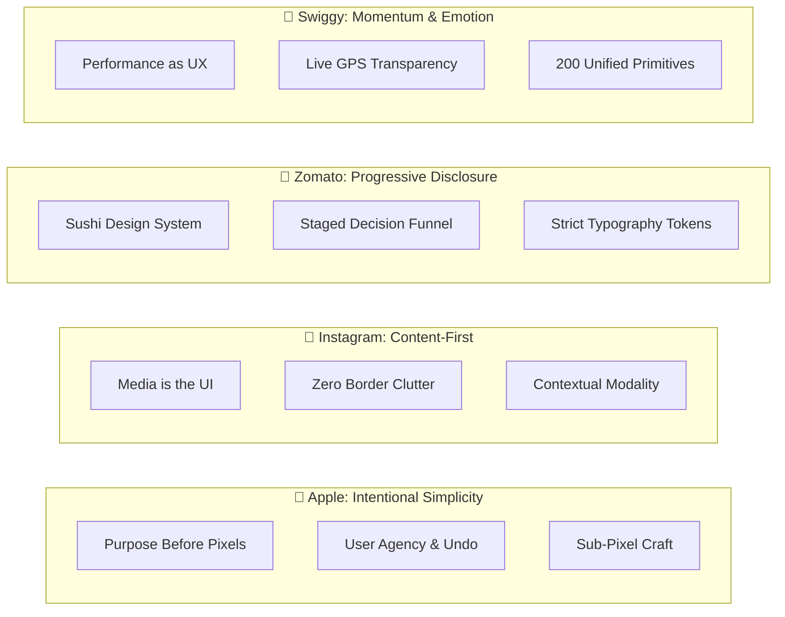
```mermaid
graph LR
    subgraph Apple["🍏 Apple: Intentional Simplicity"]
        A1["Purpose Before Pixels"]
        A2["User Agency & Undo"]
        A3["Sub-Pixel Craft"]
    end

    subgraph Instagram["📸 Instagram: Content-First"]
        I1["Media is the UI"]
        I2["Zero Border Clutter"]
        I3["Contextual Modality"]
    end

    subgraph Zomato["🍣 Zomato: Progressive Disclosure"]
        Z1["Sushi Design System"]
        Z2["Staged Decision Funnel"]
        Z3["Strict Typography Tokens"]
    end

    subgraph Swiggy["🛵 Swiggy: Momentum & Emotion"]
        S1["Performance as UX"]
        S2["Live GPS Transparency"]
        S3["200 Unified Primitives"]
    end
```

### 4.1 Apple — Intentional Simplicity & Agency

- **Purpose before pixels:** Every control must justify its existence. If an action is secondary, tuck it away; if it is vital, make it unmistakable.
- **User Agency:** Never trap users in dead ends. Destructive actions must provide immediate forgiveness (`[Undo]`) rather than intimidating confirmation dialogs.
- **Craft of the Invisible:** Sub-pixel alignment, fluid gesture tracking, and haptic feedback that users cannot name but instantly admire.

### 4.2 Instagram — Content-First & Adaptive Contexts

- **The content IS the interface:** Heavy chrome, borders, and dark drop shadows compete with the creator's media. Strip away visual noise and reveal controls on demand.
- **Contextual Form Factors:** Desktop and mobile are distinct behavioral environments, not just different viewport widths.

### 4.3 Zomato — Progressive Disclosure (The Sushi System)

- **Staged Decision Funnel:** `Cuisine Chip` $\rightarrow$ `Restaurant Card` $\rightarrow$ `Menu Item` $\rightarrow$ `Customization Modal` $\rightarrow$ `Checkout`.
- **Systematized Typography:** Eliminates arbitrary font sizes with strict scale tokens (`TEXT-100` through `TEXT-500`).

### 4.4 Swiggy — Momentum & Friction Elimination

- **Performance is UX:** UI jank and slow load times kill conversion. Order tracking provides continuous, animated real-world transparency (live rider GPS + ETA).
- **Cross-Service Cohesion:** ~200 unified primitives bridge Food Delivery, Instamart (grocery), and Dining into one intuitive ecosystem.

### Big Tech Strategy Matrix

| Dimension | Apple | Instagram | Zomato | Swiggy |
| :--- | :--- | :--- | :--- | :--- |
| **Primary Driver** | Mental clarity & ease | Visual immersion | Decision simplification | Speed & momentum |
| **Visual Palette** | Neutral with system accents | Deep contrast framing | Warm, appetite-stimulating | Energetic, vibrant |
| **Motion Physics** | Subtle, fluid springs | Snappy direct manipulation | Informative transitions | Delight & live tracking |
| **Design System** | Human Interface Guidelines | Cross-platform core | Sushi Design System | Custom Component Library |

[⬆ Back to Table of Contents](#table-of-contents)

---

## 5. Mathematical Proportion Systems

```text
┌────────────────────────────────────────────────────────┐
│                THE GOLDEN RATIO (φ ≈ 1.618)            │
├───────────────────────────────┬────────────────────────┤
│                               │                        │
│      PRIMARY CONTENT (61.8%)  │    SIDEBAR (38.2%)     │
│                               │                        │
└───────────────────────────────┴────────────────────────┘
```

### Typography Scale (Base 16px × 1.618 or 1.25 Modular Scale)

- **Display Hero:** `56px – 64px` (Weight: 800, Line-height: 1.1)
- **H1 Section Header:** `36px – 40px` (Weight: 700, Line-height: 1.2)
- **H2 Card Subtitle:** `24px – 28px` (Weight: 600, Line-height: 1.3)
- **Body Regular:** `16px` (Weight: 400, Line-height: 1.6)
- **Caption / Metadata:** `12px – 14px` (Weight: 500, Line-height: 1.4)

### Spacing Scale (8pt Grid Standard)

```text
4px (xxs) · 8px (xs) · 12px (sm) · 16px (md) · 24px (lg) · 32px (xl) · 48px (2xl) · 64px (3xl)
```

> [!TIP]
> **Spatial Rule:** Use mathematical ratios for high-level viewport layouts and typographic rhythm. Do not force mathematical formulas into micro-padding if it compromises component ergonomics.

[⬆ Back to Table of Contents](#table-of-contents)

---

## 6. Visual Styles & When to Use Each

### Modern Aesthetic Decision Tree

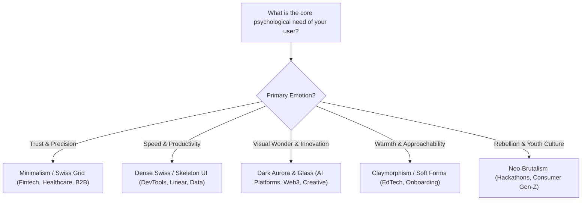
```mermaid
flowchart TD
    Start["What is the core psychological need of your user?"] --> Q1{"Primary Emotion?"}
    Q1 -->|Trust & Precision| S1["Minimalism / Swiss Grid (Fintech, Healthcare, B2B)"]
    Q1 -->|Speed & Productivity| S2["Dense Swiss / Skeleton UI (DevTools, Linear, Data)"]
    Q1 -->|Visual Wonder & Innovation| S3["Dark Aurora & Glass (AI Platforms, Web3, Creative)"]
    Q1 -->|Warmth & Approachability| S4["Claymorphism / Soft Forms (EdTech, Onboarding)"]
    Q1 -->|Rebellion & Youth Culture| S5["Neo-Brutalism (Hackathons, Consumer Gen-Z)"]
```

### Visual Archetype Comparison

| Visual Style | Key Characteristics | Best Use Cases | Dangerous Anti-Patterns |
| :--- | :--- | :--- | :--- |
| **Minimalism** | High whitespace, monochrome base, single accent | Fintech, Banking, B2B SaaS | Low contrast grey-on-white text |
| **Swiss Style** | Rigid mathematical grid, bold typography, objective structure | Analytics, Developer Docs, Portfolios | Emotionless, sterile landing pages |
| **Dark Aurora** | Deep dark canvas (`#0b0f17`), neon blurred radial glows | AI platforms, Web3, Dev Tools | Data-dense spreadsheets, bright daylight tools |
| **Glassmorphism** | `backdrop-filter: blur()`, 1px translucent borders | Floating command palettes, elevated modals | Applying across entire background (kills legibility) |
| **Claymorphism** | Rounded pill shapes, dual inner/outer soft drop shadows | EdTech, Gamified Apps, Onboarding | Enterprise data tables, legal/tax software |
| **Neo-Brutalism** | Thick 2px-3px black borders, hard offset drop shadows | Startup launchpads, Gen-Z social | Trust-critical banking, medical dashboards |

[⬆ Back to Table of Contents](#table-of-contents)

---

## 7. Loading, States & the "Unhappy Path"

A production-grade interface accounts for all 8 states of every interactive component:

```mermaid
stateDiagram-v2
    [*] --> Default
    Default --> Hover: Cursor Enter
    Hover --> Focus: Tab / Click
    Focus --> Active: Mouse Down / Key Press
    Active --> Loading: Mutation Triggered
    
    state Loading {
        [*] --> CheckType
        CheckType --> SkeletonScreen: Layout Known
        CheckType --> DeterminateProgress: Measurable Bytes/Time
        CheckType --> Spinner: Localized Action
    }
    
    Loading --> Success: Server 200 OK
    Loading --> Error: Network / Validation Fail
    
    Success --> Default: Timeout / Auto-dismiss
    Error --> Default: User Corrects / Retries
```

### Loading Strategy Decision Matrix

| Scenario | Recommended Strategy | Psychological Impact |
| :--- | :--- | :--- |
| **Initial Feed / Table Load** | Shimmer Skeleton Screen | Reduces perceived wait time; eliminates layout shift |
| **Large File Upload / Export** | Determinate Progress Bar (MB + ETA) | Eliminates anxiety; gives exact completion estimates |
| **Inline Button Action (Like, Save)** | Localized Spinner / Instant Optimistic UI | Immediate feedback; prevents duplicate submit clicks |
| **Full Page Navigation** | View Transitions API / Top Slim Bar | Smooth spatial continuity across routes |

> [!NOTE]
> **Optimistic UI Protocol:** Update the client interface immediately for low-risk, reversible actions (favoriting, liking, saving a draft). If the network request fails, silently roll back and trigger an unobtrusive notification with an explicit retry action.

[⬆ Back to Table of Contents](#table-of-contents)

---

## 8. The Modern Frontend & Design Engineering Stack

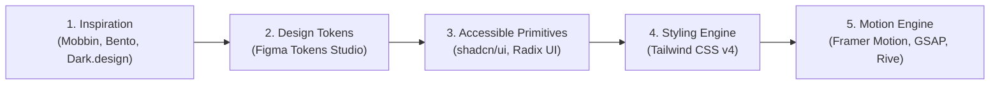
```mermaid
flowchart LR
    Inspiration["1. Inspiration<br>(Mobbin, Bento, Dark.design)"] --> Design["2. Design Tokens<br>(Figma Tokens Studio)"]
    Design --> Foundation["3. Accessible Primitives<br>(shadcn/ui, Radix UI)"]
    Foundation --> Styling["4. Styling Engine<br>(Tailwind CSS v4)"]
    Styling --> Motion["5. Motion Engine<br>(Framer Motion, GSAP, Rive)"]
```

```text
┌────────────────────────────────────────────────────────────────────────┐
│ 1. RESEARCH & INSPIRATION  │ Mobbin · Land-book · Dark.design · Bento   │
├────────────────────────────┼───────────────────────────────────────────┤
│ 2. DESIGN & SYSTEM TOKENS  │ Figma (Tokens Studio, Auto-Layout 5.0)    │
├────────────────────────────┼───────────────────────────────────────────┤
│ 3. UI PRIMITIVES & A11Y    │ shadcn/ui · Radix UI · Base UI (MUI)      │
├────────────────────────────┼───────────────────────────────────────────┤
│ 4. STYLING ENGINE          │ Tailwind CSS (v3/v4) · CSS Variables      │
├────────────────────────────┼───────────────────────────────────────────┤
│ 5. MOTION & INTERACTION    │ Motion (Framer) · GSAP · Lenis · Rive     │
├────────────────────────────┼───────────────────────────────────────────┤
│ 6. ICONOGRAPHY & ASSETS    │ Lucide Icons · Tabler Icons · SVGs        │
└────────────────────────────────────────────────────────────────────────┘
```

[⬆ Back to Table of Contents](#table-of-contents)

---

## 9. Motion & Animation Technology Map

```text
Micro-interactions (Hover, Press, Active)  ──► CSS Transitions / Transforms
Component State (Dialogs, Tabs, Toasts)    ──► Framer Motion / Motion
Choreographed Marketing Narrative          ──► GSAP + ScrollTrigger
Smooth Inertial Page Scroll                ──► Lenis Scroll
Interactive Stateful Vector Characters     ──► Rive
3D Hero Interactive Visualizations         ──► Three.js / React Three Fiber
Zero-JS Multi-Page Transitions             ──► Native View Transitions API
```

### Spring Physics vs Linear Timing

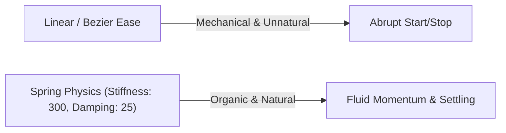
```mermaid
graph LR
    A["Linear / Bezier Ease"] -->|Mechanical & Unnatural| B["Abrupt Start/Stop"]
    C["Spring Physics (Stiffness: 300, Damping: 25)"] -->|Organic & Natural| D["Fluid Momentum & Settling"]
```

```css
/* Golden Accessibility Rule: Always respect user preferences */
@media (prefers-reduced-motion: reduce) {
  *, ::before, ::after {
    animation-duration: 0.01ms !important;
    animation-iteration-count: 1 !important;
    transition-duration: 0.01ms !important;
    scroll-behavior: auto !important;
  }
}
```

[⬆ Back to Table of Contents](#table-of-contents)

---

## 10. Cognitive Psychology, Business Logic & Retention

### Universal UX Laws

1. **Hick's Law:** Decision time increases logarithmically with the number and complexity of choices ($RT = a + b \log_2(n)$). Break 20 choices into 3 sequential steps.
2. **Fitts's Law:** Target acquisition time depends on distance ($D$) and button size ($W$): $T = a + b \log_2(1 + D/W)$. Place primary actions in the natural thumb zone.
3. **Miller's Law & Chunking:** Human working memory holds $7 \pm 2$ chunks of information. Format phone numbers (`(555) 019-2831`), credit cards, and metrics into digestible segments.
4. **The Peak-End Rule:** Users evaluate an experience by its emotional peak and conclusion. Deliver high clarity at checkout, export, and onboarding completion.
5. **The Zeigarnik Effect:** Incomplete tasks occupy active mental memory. Use progress indicators ("Step 2 of 3") to motivate form completion.

### The Retention Flywheel

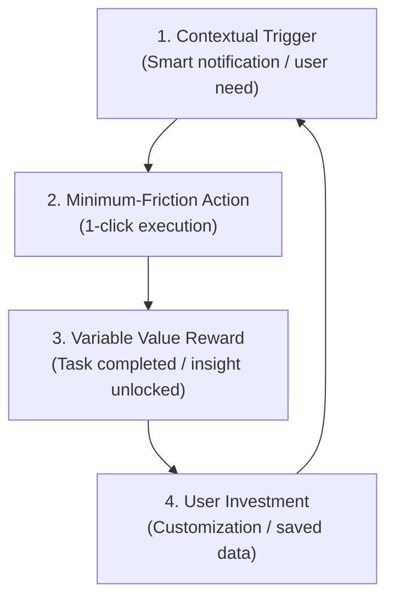
```mermaid
graph TD
    Trigger["1. Contextual Trigger<br>(Smart notification / user need)"] --> Action["2. Minimum-Friction Action<br>(1-click execution)"]
    Action --> Reward["3. Variable Value Reward<br>(Task completed / insight unlocked)"]
    Reward --> Investment["4. User Investment<br>(Customization / saved data)"]
    Investment --> Trigger
```

### Dark Patterns Blacklist

```text
❌ Confirm-Shaming       ("No thanks, I hate saving money")
❌ Hidden Subscriptions  (Hiding cancellation behind phone call requirements)
❌ Fake Urgency          (Artificial timers that reset upon page refresh)
❌ Roach Motel           (Effortless 1-click signup, 14-step cancellation)
❌ Sneak-into-Basket     (Pre-checking insurance or donation add-ons)
```

[⬆ Back to Table of Contents](#table-of-contents)

---

## 11. The Real-World Production Design Process

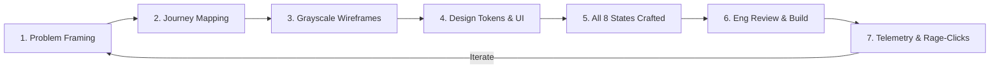
```mermaid
flowchart LR
    P1["1. Problem Framing"] --> P2["2. Journey Mapping"]
    P2 --> P3["3. Grayscale Wireframes"]
    P3 --> P4["4. Design Tokens & UI"]
    P4 --> P5["5. All 8 States Crafted"]
    P5 --> P6["6. Eng Review & Build"]
    P6 --> P7["7. Telemetry & Rage-Clicks"]
    P7 -->|Iterate| P1
```

[⬆ Back to Table of Contents](#table-of-contents)

---

## 12. Research & Benchmarking Ecosystem

- **Mobbin:** The industry standard for auditing real production flows (onboarding, upgrade paywalls, settings).
- **Land-book & Bento.me:** Composition, hero typography, and landing page conversion layouts.
- **Dark.design:** High-contrast dark themes, ambient lighting, and developer-oriented interfaces.
- **Dribbble & Layers:** Visual aesthetic inspiration (extract principles, never copy untested mockups directly into production).

[⬆ Back to Table of Contents](#table-of-contents)

---

## 13. The 15 Real-World Before/After Visual Demos

---

### Demo 1: The Vanishing Save Button

#### Immediate Acknowledgment & Reassuring Feedback

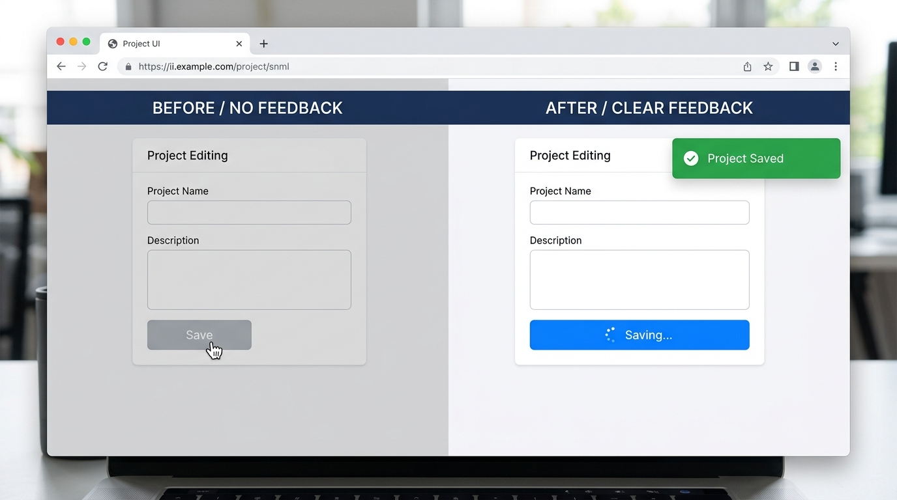

```text
❌ BEFORE (Silent / Confusing)                 ✅ AFTER (Deterministic Feedback)
┌───────────────────────────┐                 ┌───────────────────────────┐
│  [ Save ]                 │                 │  [ ⟳ Saving... ]          │
│  (Click) ──► (No Change)  │                 │  (Click) ──► Instant Spin │
│  User clicks 4 more times │                 │            ──► ✓ Saved!   │
└───────────────────────────┘                 └───────────────────────────┘
```

- **The Broken Pattern:** Clicking "Save" yields no visual feedback for 1.5 seconds. The user assumes the click missed or the app froze, repeatedly mashing the button and triggering duplicate API mutations.
- **The Engineered Fix:** The button immediately changes state to `Saving...` with an animated spinner and disabled pointer events, followed by a crisp green checkmark toast.
- **Core Principle:** Every user action requires a 3-step lifecycle: **Acknowledge $\rightarrow$ Process $\rightarrow$ Resolve**. Silence is always interpreted as failure.
- **Technical Specs:** CSS transition `background-color 150ms ease`, ARIA live region `aria-live="polite"`, `role="status"`.
- **Industry Reference:** Notion, Linear, and Google Docs use inline status indicators ("Saving…" / "Saved to Cloud") to eliminate user anxiety.

[⬆ Back to Table of Contents](#table-of-contents)

---

### Demo 2: Loading Spinner vs Skeleton Screen

#### Perceived Performance & Structural Anticipation

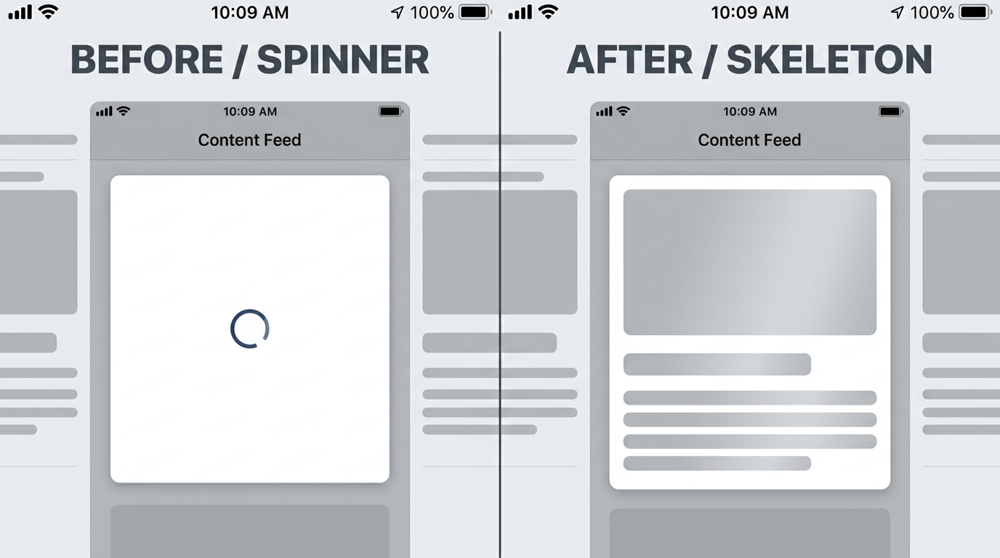

```text
❌ BEFORE (Spinner in Void)                    ✅ AFTER (Spatial Skeleton)
┌───────────────────────────┐                 ┌───────────────────────────┐
│                           │                 │ [ ░░░░░░ ]  [░░░░░░░░░░░] │
│             ⟳             │                 │ ░░░░░░░░░░░░░░░░░░░░░░░░  │
│   "How long will this take?"│               │ ░░░░░░░░░░░░░░░░░░░       │
└───────────────────────────┘                 └───────────────────────────┘
```

- **The Broken Pattern:** A blank white card with a lonely spinner provides zero spatial context, making a 2-second load feel like an eternity.
- **The Engineered Fix:** Animated shimmering skeleton bars mimic the exact proportions of avatars, headlines, and body text.
- **Core Principle:** Perceived performance matters more than raw stopwatch benchmarks. Skeletons prime the user's mental model for incoming content.
- **Technical Specs:** CSS `@keyframes shimmer { 0% { background-position: -200% 0; } 100% { background-position: 200% 0; } }` with linear gradient wave.
- **Industry Reference:** Facebook, LinkedIn, YouTube, and Slack render skeleton placeholders to ensure zero layout shift upon data arrival.

[⬆ Back to Table of Contents](#table-of-contents)

---

### Demo 3: The 12-Error Form Dump

#### Real-Time Inline Guidance vs Post-Submit Shock

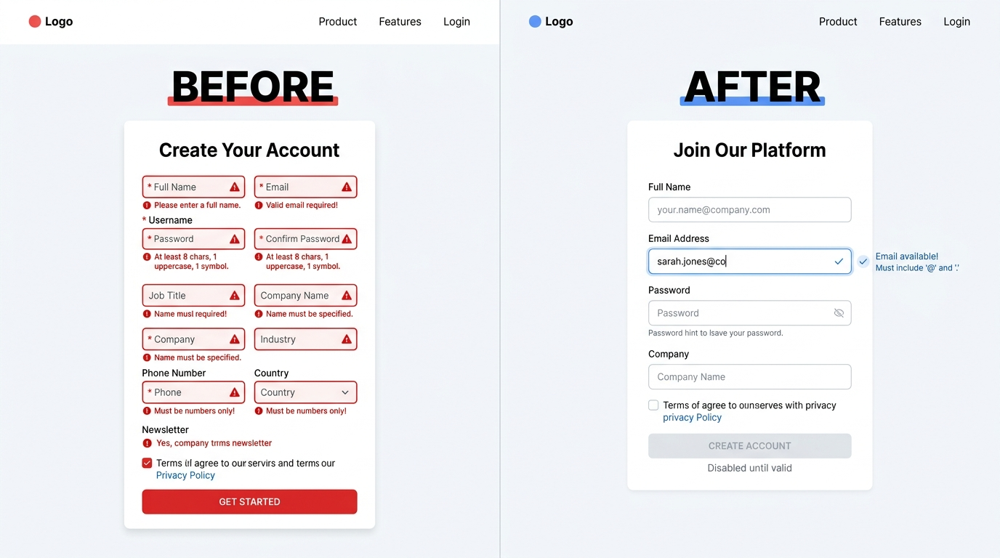

```text
❌ BEFORE (Submit & Explode)                   ✅ AFTER (As-You-Type Inline)
┌───────────────────────────┐                 ┌───────────────────────────┐
│ [Submit] ──► 12 RED BOXES │                 │ Email [ alex@domain.c   ] │
│ ⚠️ Field 1 is required    │                 │ ℹ️ Enter a valid domain   │
│ ⚠️ Field 4 format invalid │                 │ (Gentle hint while active)│
└───────────────────────────┘                 └───────────────────────────┘
```

- **The Broken Pattern:** The user fills 15 fields, clicks "Create Account", and is suddenly assaulted by a wall of 12 red error messages at the top of the page.
- **The Engineered Fix:** Real-time inline validation evaluates fields on blur or throttle, presenting clear, helpful guidance alongside the active field.
- **Core Principle:** Never withhold validation rules until submission. Validate progressively and pair every error with an actionable solution.
- **Technical Specs:** `aria-describedby="email-hint"`, `aria-invalid="false"`, inline debounce delay `300ms`.
- **Industry Reference:** Stripe Checkout is the global benchmark for forgiving, real-time input formatting and validation.

[⬆ Back to Table of Contents](#table-of-contents)

---

### Demo 4: Navbar Overload

#### Visual Hierarchy & Progressive Disclosure

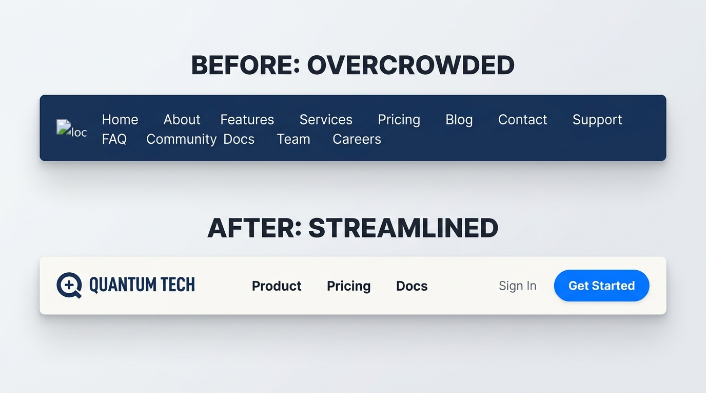

```text
❌ BEFORE (12-Link Sitemap Nav)                ✅ AFTER (Curated 3-Link + CTA)
┌───────────────────────────┐                 ┌───────────────────────────┐
│ [Logo] Home About Features│                 │ [Logo]  Features  Pricing │
│ Blog Team Docs FAQ Contact│                 │ Docs      [Get Started →] │
└───────────────────────────┘                 └───────────────────────────┘
```

- **The Broken Pattern:** Dumping 12 navigation links across the header overwhelms the eye and destroys visual hierarchy.
- **The Engineered Fix:** Consolidate navigation down to 3 high-impact links, a "Sign In" link, and a prominent primary CTA button. Secondary links move into footer or dropdown menus.
- **Core Principle:** The navbar is high-value real estate for core conversion paths, not a dump site for your company sitemap.
- **Technical Specs:** CSS Flexbox with `gap: 2rem`, responsive hamburger breakpoint at `<768px`.
- **Industry Reference:** Apple.com maintains $\le 6$ header items, organizing thousands of sub-pages through intuitive progressive discovery.

[⬆ Back to Table of Contents](#table-of-contents)

---

### Demo 5: Card Overload Dashboard

#### Progressive Metric Disclosure & Cognitive Focus

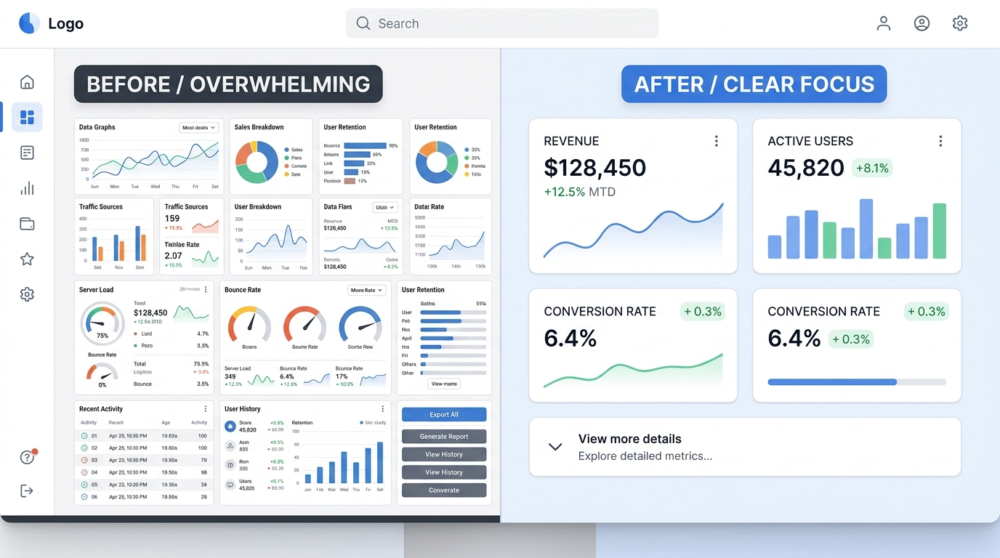

```text
❌ BEFORE (25 Small Cluttered Charts)          ✅ AFTER (3 Core KPIs + Drawer)
┌──────┬──────┬──────┬──────┐                 ┌──────────────┬────────────┐
│Chart1│Chart2│Chart3│Chart4│                 │ REVENUE      │ ACTIVE USR │
├──────┼──────┼──────┼──────┤                 │ $128,450     │ 45,820     │
├──────┼──────┼──────┼──────┤                 ├──────────────┴────────────┤
│Chart5│Chart6│Chart7│Chart8│                 │ [▼ View Detailed Metrics] │
└──────┴──────┴──────┴──────┘                 └───────────────────────────┘
```

- **The Broken Pattern:** 25 cramped widgets and tiny sparklines fighting for attention simultaneously, inducing analysis paralysis.
- **The Engineered Fix:** Lead with 3 bold headline metric cards (Revenue, Active Users, Conversion Rate) accompanied by an expandable exploration drawer.
- **Core Principle:** A great dashboard answers three questions in under 5 seconds: *What is happening? Is it good or bad? What action should I take?*
- **Technical Specs:** CSS Grid `grid-template-columns: repeat(auto-fit, minmax(280px, 1fr))`, Collapsible Accordion primitive with Radix UI.
- **Industry Reference:** Stripe Dashboard and Google Analytics 4 lead with core summaries before expanding into multi-dimensional tables.

[⬆ Back to Table of Contents](#table-of-contents)

---

### Demo 6: Search Box vs Command Palette

#### Keyboard-First Power Navigation (⌘K)

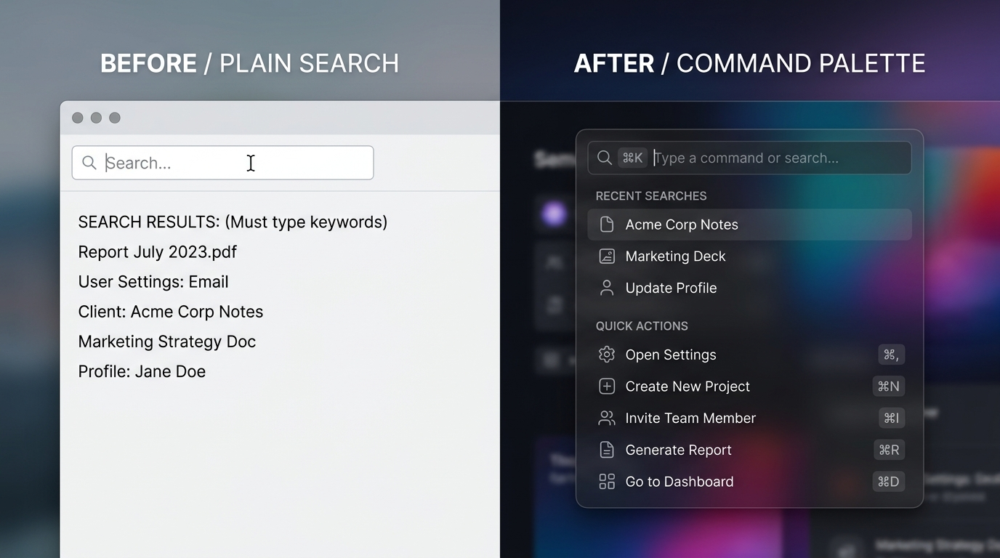

```text
❌ BEFORE (Plain Keyword Search)               ✅ AFTER (Command Palette ⌘K)
┌───────────────────────────┐                 ┌───────────────────────────┐
│ 🔍 [ Search...          ] │                 │ ⌘K [ Jump to project... ] │
│ (User must remember terms)│                 │ • Recent Searches         │
│                           │                 │ • Quick Actions (⌘N, ⌘S)  │
└───────────────────────────┘                 └───────────────────────────┘
```

- **The Broken Pattern:** A passive text input that forces users to recall exact keyword strings without fuzzy matching or workflow shortcuts.
- **The Engineered Fix:** A floating `⌘K` command palette overlay that blends recent history, fuzzy search, and keyboard shortcuts on a backdrop blur.
- **Core Principle:** Accelerate power users without confusing novice users. Transform search from a lookup tool into an execution engine.
- **Technical Specs:** `cmdk` library, fuzzy string matching (Fuse.js / uFuzzy), backdrop blur `backdrop-filter: blur(12px)`.
- **Industry Reference:** Linear, Raycast, GitHub, and Superhuman established `⌘K` as the gold standard for high-velocity software.

[⬆ Back to Table of Contents](#table-of-contents)

---

### Demo 7: Destructive Delete Without Undo

#### Forgiving Design, Reversibility & User Agency

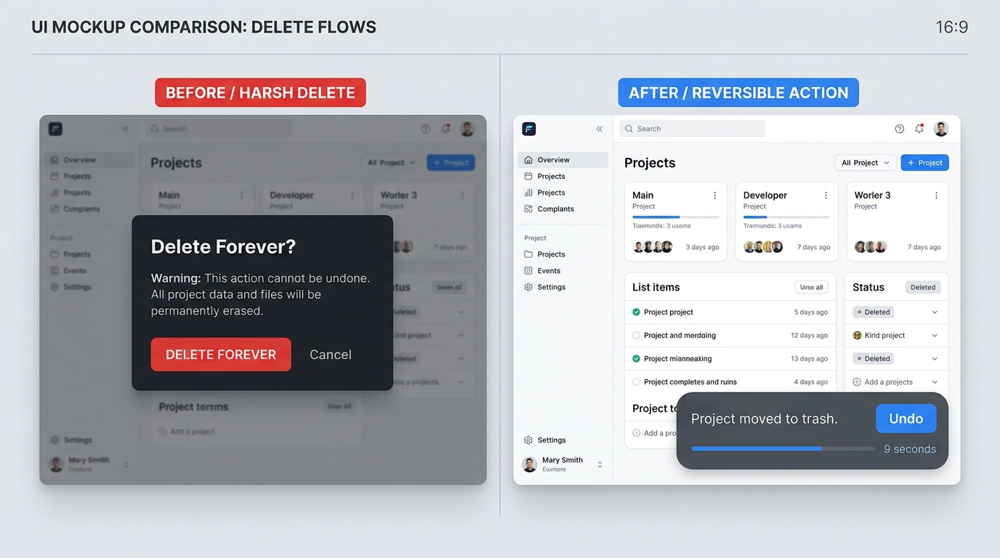

```text
❌ BEFORE (Intimidating Modal)                 ✅ AFTER (Bottom Toast + Undo)
┌───────────────────────────┐                 ┌───────────────────────────┐
│ Delete Forever?           │                 │ Project moved to trash.   │
│ [CANCEL]  [DELETE FOREVER]│                 │ [ Undo ]   (9s remaining) │
└───────────────────────────┘                 └───────────────────────────┘
```

- **The Broken Pattern:** Alarming red modal dialogs that force users to read intimidating warnings and confirm every routine deletion.
- **The Engineered Fix:** Soft deletion with a transient bottom toast notification containing an instant `[Undo]` button and a countdown timer.
- **Core Principle:** Forgiving systems make actions easily reversible rather than demanding cognitive friction upfront.
- **Technical Specs:** Sonner toast library, soft-delete optimistic mutation with 8-second execution delay.
- **Industry Reference:** Gmail's "Message Sent / Deleted [Undo]" toast saves millions of inadvertent mistakes daily without modal interruptions.

[⬆ Back to Table of Contents](#table-of-contents)

---

### Demo 8: Generic Placeholder-Only Inputs

#### Persistent Field Labels & Accessible Forms

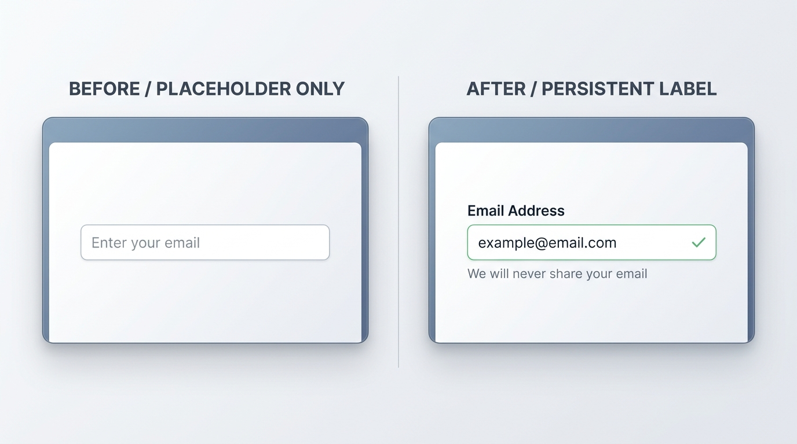

```text
❌ BEFORE (Disappearing Placeholder)           ✅ AFTER (Persistent Label + Helper)
┌───────────────────────────┐                 ┌───────────────────────────┐
│ [ Enter your email...   ] │                 │ Email Address             │
│ (Text vanishes on typing) │                 │ [ alex@company.com    ✓ ] │
│ "Wait, what field is this?"│                │ We'll never share your data│
└───────────────────────────┘                 └───────────────────────────┘
```

- **The Broken Pattern:** Using placeholder text as the sole field label. The instant the user clicks or auto-fills, the label disappears.
- **The Engineered Fix:** A persistent label positioned clearly above the input, complemented by supporting helper text below.
- **Core Principle:** Placeholders are temporary formatting examples, never labels. Losing context mid-form increases error rates and fails accessibility.
- **Technical Specs:** HTML `<label for="email">`, floating label transition `transform 150ms cubic-bezier(0.4, 0, 0.2, 1)`.
- **Industry Reference:** Revolut, Stripe, and Shopify maintain strict persistent labels across all checkout and identity inputs.

[⬆ Back to Table of Contents](#table-of-contents)

---

### Demo 9: Flat vs Progressive Onboarding

#### Step-by-Step Chunking & Momentum Building

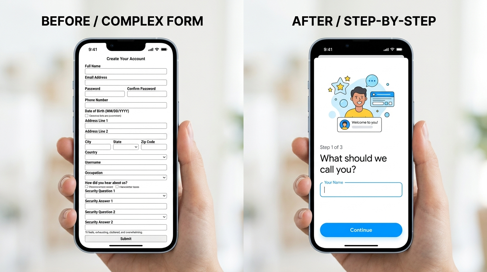

```text
❌ BEFORE (20-Field Wall of Pain)              ✅ AFTER (Step 1 of 3 Card)
┌───────────────────────────┐                 ┌───────────────────────────┐
│ Full Name [             ] │                 │ Step 1 of 3               │
│ Address   [             ] │                 │ What should we call you?  │
│ Phone     [             ] │                 │ [ Your Name           ]   │
│ 17 more fields below...   │                 │ [ Continue →          ]   │
└───────────────────────────┘                 └───────────────────────────┘
```

- **The Broken Pattern:** Demanding all user information upfront in a single, intimidating 20-field scrolling form.
- **The Engineered Fix:** Progressive multi-step wizard showing "Step 1 of 3" with a friendly illustration, one focused question, and a clear next step.
- **Core Principle:** Chunking reduces cognitive load. Users who complete small micro-commitments build momentum to finish the onboarding funnel.
- **Technical Specs:** Step-state machine in React/Zustand, animated slide transitions with `AnimatePresence` mode="wait".
- **Industry Reference:** Duolingo, Typeform, and Airbnb onboard millions by isolating single decisions per screen.

[⬆ Back to Table of Contents](#table-of-contents)

---

### Demo 10: Blind Waiting vs Staged AI Loading

#### AI Interaction Transparency & Mental Legibility

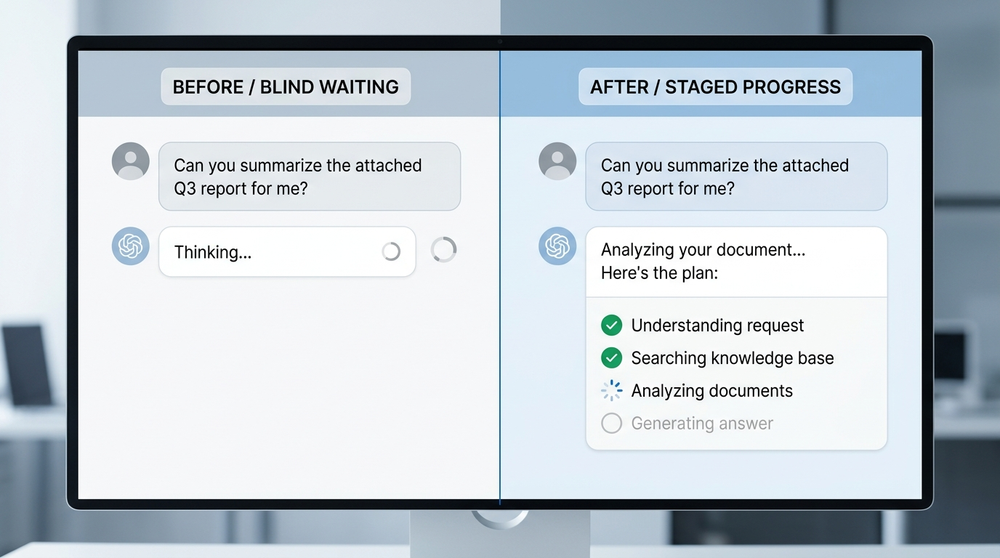

```text
❌ BEFORE (Blind "Thinking...")                ✅ AFTER (Staged Progress Checklist)
┌───────────────────────────┐                 ┌───────────────────────────┐
│ [AI Bot]                  │                 │ ✓ Understanding request   │
│ Thinking...               │                 │ ✓ Searching knowledge base│
│ (Zero sense of progress)  │                 │ ⟳ Analyzing documents     │
│                           │                 │ ○ Generating answer       │
└───────────────────────────┘                 └───────────────────────────┘
```

- **The Broken Pattern:** An opaque "Thinking..." label that leaves users wondering if the model is stuck, hallucinating, or failing.
- **The Engineered Fix:** Granular staged progress checklist detailing exactly what sub-tasks the AI is executing in real time.
- **Core Principle:** AI UX requires system legibility. When users see the agent's research and reasoning steps, trust increases dramatically.
- **Technical Specs:** Server-Sent Events (SSE) streaming JSON milestones, Lucide animated spinner icons.
- **Industry Reference:** Perplexity AI, ChatGPT Deep Research, and Claude Artifacts explicitly display tool calls and staged milestones.

[⬆ Back to Table of Contents](#table-of-contents)

---

### Demo 11: Cluttered Chrome vs Content-First Feed

#### Visual Immersion & Minimalist Framing


```text
❌ BEFORE (Heavy Borders & Badges)             ✅ AFTER (Full-Bleed Media)
┌───────────────────────────┐                 ┌───────────────────────────┐
│ ╔═══════════════════════╗ │                 │                           │
│ ║ [User] #Travel #Maui  ║ │                 │     FULL BLEED PHOTO      │
│ ║ [Image with 3 Borders]║ │                 │                           │
│ ║ [Like] [Share] [Tags] ║ │                 │ ♡   💬   ↗  (Minimal HUD) │
│ ╚═══════════════════════╝ │                 │                           │
└───────────────────────────┘                 └───────────────────────────┘
```

- **The Broken Pattern:** Framing media inside heavy container borders, thick shadows, and noisy metadata cards that distract from the photo.
- **The Engineered Fix:** Full-bleed edge-to-edge photography with minimal, translucent floating interaction icons that reveal on tap.
- **Core Principle:** The UI should frame the content, never compete with it. For media-rich products, the content *is* the interface.
- **Technical Specs:** `object-fit: cover`, CSS overlay linear-gradient `rgba(0,0,0,0.6) 0%, transparent 40%`.
- **Industry Reference:** Instagram and TikTok removed almost all container chrome to maximize visual immersion.

[⬆ Back to Table of Contents](#table-of-contents)

---

### Demo 12: Filter Overload vs Progressive Discovery

#### Staged Decision Funnels (The Zomato/Swiggy Model)

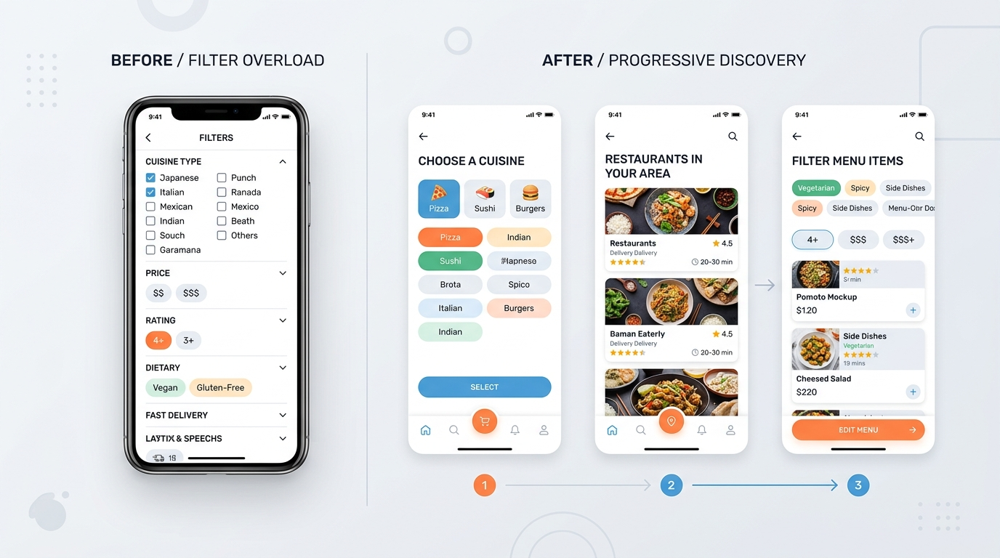

```text
❌ BEFORE (15 Simultaneous Checkboxes)         ✅ AFTER (3-Step Discovery Funnel)
┌───────────────────────────┐                 ┌───────┐ ┌────────┐ ┌───────┐
│ ☑ Pizza   ☑ Rating 4+     │                 │Step 1 │►│Step 2  │►│Step 3 │
│ ☑ Sushi   ☑ Pure Veg      │                 │Cuisine│ │Nearby  │ │Dietary│
│ ☑ Burgers ☑ Price $$      │                 │Chips  │ │Cards   │ │Filters│
└───────────────────────────┘                 └───────┘ └────────┘ └───────┘
```

- **The Broken Pattern:** Displaying dozens of cuisine checkboxes, rating filters, delivery times, and price sliders all at once on the initial screen.
- **The Engineered Fix:** Staged decision funnel: visual cuisine category chips first $\rightarrow$ curated restaurant cards with ratings $\rightarrow$ granular dish-level filters.
- **Core Principle:** Eliminate choice overload by guiding users through sequential, bite-sized decision steps.
- **Technical Specs:** Horizontal scroll container with snap points `scroll-snap-type: x mandatory`, active pill badge tokens.
- **Industry Reference:** Zomato's Sushi design system and Swiggy's food discovery funnel structure ordering decisions progressively.

[⬆ Back to Table of Contents](#table-of-contents)

---

### Demo 13: Generic Empty State vs Guided Empty State

#### Transforming Dead Ends into Onboarding Moments

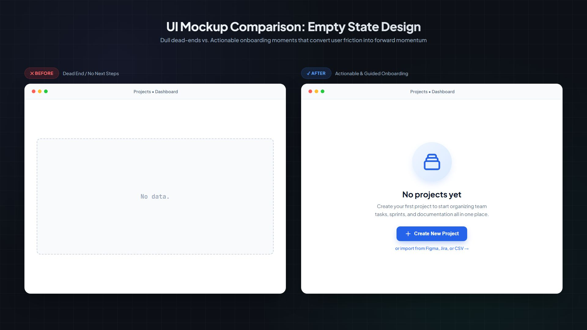

```text
❌ BEFORE (Cold Dead End)                      ✅ AFTER (Actionable Onboarding)
┌───────────────────────────┐                 ┌───────────────────────────┐
│                           │                 │       [ 📁 Icon ]         │
│         No data.          │                 │     No projects yet       │
│                           │                 │ Create your first project │
│                           │                 │   [ + Create Project ]    │
└───────────────────────────┘                 └───────────────────────────┘
```

- **The Broken Pattern:** A cold, empty grey box with a passive "No data." message that strands the user with no clear path forward.
- **The Engineered Fix:** A friendly illustrated empty state featuring a clear headline, value-proposition explanation, and a primary "+ Create Project" button.
- **Core Principle:** Every empty state must answer three questions: *What belongs here? Why is it empty? How do I add my first item?*
- **Technical Specs:** SVG illustration, Flexbox column centering, secondary import link.
- **Industry Reference:** GitHub, Asana, and Linear turn zero-data views into guided onboarding launchpads.

[⬆ Back to Table of Contents](#table-of-contents)

---

### Demo 14: Frozen Blank Screen vs Determinate Progress

#### Wait Transparency & Anxiety Mitigation

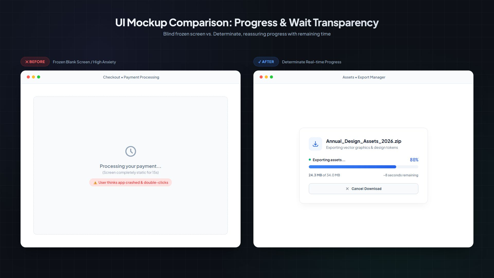

```text
❌ BEFORE (Frozen Static Screen)               ✅ AFTER (Determinate Progress)
┌───────────────────────────┐                 ┌───────────────────────────┐
│                           │                 │ Exporting Assets... 80%   │
│ Processing payment...     │                 │ [████████████████░░░░]    │
│ (Screen frozen for 15s)   │                 │ 24.3 MB / 34 MB • ~8s left│
│ ⚠️ Did it crash?          │                 │ [ Cancel Download ]       │
└───────────────────────────┘                 └───────────────────────────┘
```

- **The Broken Pattern:** Clicking "Pay Now" or "Export" freezes the screen with an indeterminate spinner, causing anxiety over whether the transaction failed.
- **The Engineered Fix:** A determinate progress bar displaying current percentage, transferred megabytes, estimated time remaining, and a safe cancel option.
- **Core Principle:** When an operation has a measurable duration, always provide determinate progress. Transparency eliminates abandonment.
- **Technical Specs:** HTML5 `<progress>` or custom `div` with `width: ${percent}%`, animated transition `width 200ms ease-out`.
- **Industry Reference:** macOS file transfers and Swiggy/Uber real-time GPS tracking alleviate operational waiting anxiety.

[⬆ Back to Table of Contents](#table-of-contents)

---

### Demo 15: Disconnected Chatbot vs Integrated Inline AI

#### Contextual Intelligence & One-Tap Actions

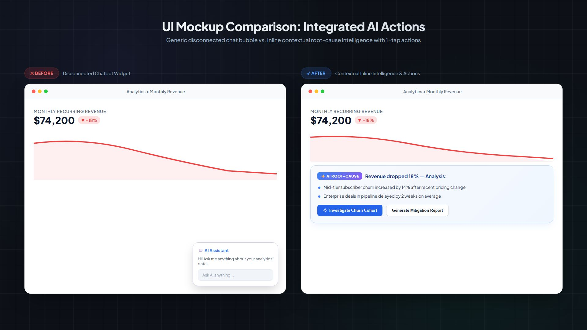

```text
❌ BEFORE (Generic Floating Bot)               ✅ AFTER (Inline Contextual Insight)
┌───────────────────────────┐                 ┌───────────────────────────┐
│ Revenue Chart             │                 │ Monthly Revenue: $74,200  │
│                           │                 │ ✨ AI Root-Cause Insight: │
│ ┌───────────────────────┐ │                 │ • Mid-tier churn up 14%   │
│ │ 💬 Ask AI anything... │ │                 │ [ Investigate Cohort ]    │
│ └───────────────────────┘ │                 │ [ Generate Report ]       │
└───────────────────────────┘                 └───────────────────────────┘
```

- **The Broken Pattern:** Bolting a generic floating chatbot bubble in the corner that knows nothing about what the user is currently viewing.
- **The Engineered Fix:** Embedding contextual AI insights directly inside the relevant revenue chart with actionable root-cause analysis and 1-tap action buttons.
- **Core Principle:** AI should not be a separate chat destination; it must be an ambient interaction layer embedded directly at the point of decision.
- **Technical Specs:** Inline card component with gradient border, direct event handlers triggering downstream filters and report generators.
- **Industry Reference:** Notion AI, Linear AI Triage, and GitHub Copilot inline suggestions embed intelligence right where work happens.

[⬆ Back to Table of Contents](#table-of-contents)

---

## 14. How Big Tech Applies These Frameworks

```text
┌─────────────────┬─────────────────────────────────────────────────────────────┐
│ Company         │ Production Architectural Application                        │
├─────────────────┼─────────────────────────────────────────────────────────────┤
│ 🍏 Apple        │ Relentless pruning of non-essential controls; haptic and    │
│                 │ spring physics calibration across iOS/macOS.                │
├─────────────────┼─────────────────────────────────────────────────────────────┤
│ 📸 Instagram    │ Eliminates borders/chrome; shifts layout dynamically based  │
│                 │ on user modality (Reels vs DMs vs Web).                     │
├─────────────────┼─────────────────────────────────────────────────────────────┤
│ 🍣 Zomato       │ Built the "Sushi" design system to eliminate user decision  │
│                 │ friction; strict tokenized typography (TEXT-100 to 500).    │
├─────────────────┼─────────────────────────────────────────────────────────────┤
│ 🛵 Swiggy       │ Zero-jank engineering across Home→Menu→Cart; live map ETA   │
│                 │ eliminates logistics anxiety; 200 unified primitives.       │
├─────────────────┼─────────────────────────────────────────────────────────────┤
│ ⚡ Linear       │ Keyboard-first command palette (⌘K); optimistic UI updates;  │
│                 │ sub-50ms interaction feedback loops.                        │
├─────────────────┼─────────────────────────────────────────────────────────────┤
│ 💳 Stripe       │ Global gold standard for inline input validation; smooth    │
│                 │ error recovery; clean, high-contrast typography hierarchy.  │
└─────────────────┴─────────────────────────────────────────────────────────────┘
```

[⬆ Back to Table of Contents](#table-of-contents)

---

## 15. Master Pre-Flight Cheat Sheet & Scorecard

Before shipping any feature or screen to production, audit against this 10-point scorecard:

```text
[ ] 1. CLARITY          → Can a first-time user identify the primary action in < 3 seconds?
[ ] 2. FEEDBACK         → Does every click/tap provide instant visual or haptic acknowledgment?
[ ] 3. LOADING STRATEGY → Is skeleton loading used for known cards, progress bars for exports?
[ ] 4. ERROR PREVENTION → Are inputs validated inline with clear, human recovery guidance?
[ ] 5. AGENCY & UNDO    → Can destructive actions be reversed via an undo toast?
[ ] 6. HIERARCHY        → Are font sizes mapped to design tokens rather than arbitrary pixels?
[ ] 7. PERSISTENCE      → Are form labels permanently visible rather than disappearing placeholders?
[ ] 8. EMPTY STATES     → Does every empty view provide an educational illustration and primary CTA?
[ ] 9. ACCESSIBILITY    → Are WCAG contrast ratios verified and keyboard shortcuts fully navigable?
[ ] 10. AI INTEGRATION  → Are AI capabilities embedded directly at the point of decision?
```

[⬆ Back to Table of Contents](#table-of-contents)

---

## 16. Visual Asset & Prompt Reference Archive

All visual assets included in this guide are located in the local `images/` directory.

### Asset Manifest

| Asset Reference | Local File Path | Category |
| :--- | :--- | :--- |
| Design Token Pyramid | `images/token-pyramid.png` | Architecture Infographic |
| Demo 1 (Save Button) | `images/demo-01-save-button.png` | Interaction Feedback |
| Demo 2 (Skeleton Loader) | `images/demo-02-skeleton-loading.png` | Perceived Performance |
| Demo 3 (Form Validation) | `images/demo-03-form-validation.png` | Form UX & Guidance |
| Demo 4 (Navbar Header) | `images/demo-04-navbar-overload.png` | Navigation Hierarchy |
| Demo 5 (SaaS Dashboard) | `images/demo-05-dashboard-overload.png` | Progressive Disclosure |
| Demo 6 (Command Palette) | `images/demo-06-command-palette.png` | Keyboard-First Search |
| Demo 7 (Undo Delete) | `images/demo-07-undo-delete.png` | Forgiving Design |
| Demo 8 (Form Labels) | `images/demo-08-form-labels.png` | Form Usability |
| Demo 9 (Onboarding Steps) | `images/demo-09-onboarding-steps.png` | Cognitive Chunking |
| Demo 10 (AI Staged Loading) | `images/demo-10-ai-staged-loading.png` | AI Legibility |
| Demo 11 (Content-First Feed) | `images/demo-11-content-first-feed.png` | Visual Immersion |
| Demo 12 (Progressive Filters) | `images/demo-12-progressive-filters.png` | Decision Funnels |
| Demo 13 (Empty State) | `images/demo-13-empty-state.jpg` | Guided Onboarding |
| Demo 14 (Progress Download) | `images/demo-14-progress-download.jpg` | Wait Transparency |
| Demo 15 (Integrated AI) | `images/demo-15-ai-integration.jpg` | Contextual AI Actions |

---

### Final Architectural Principle

```text
DO NOT merely design static screens.
ENGINEER user decisions, state transitions, failure recoveries,
and the effortless path a human takes to achieve their goal.
```

When an interface respects user attention, eliminates cognitive friction, and acknowledges every interaction with grace, users don't just complete tasks — **they return on their own.**

[⬆ Back to Table of Contents](#table-of-contents)
